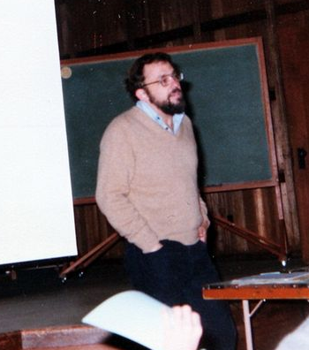
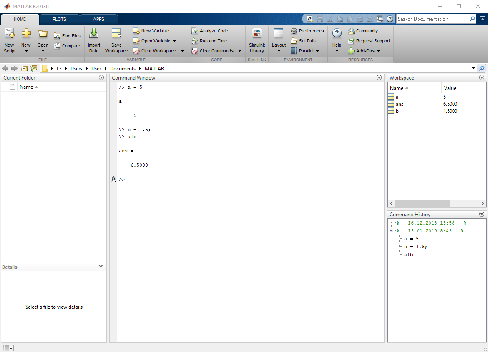
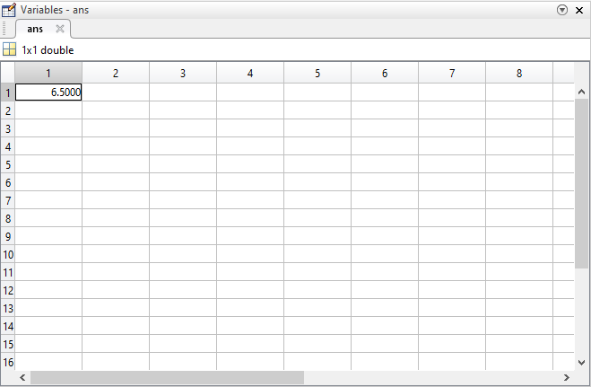
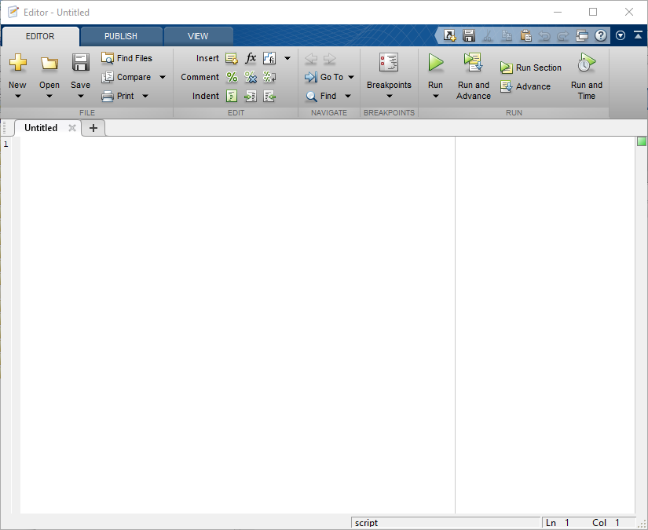
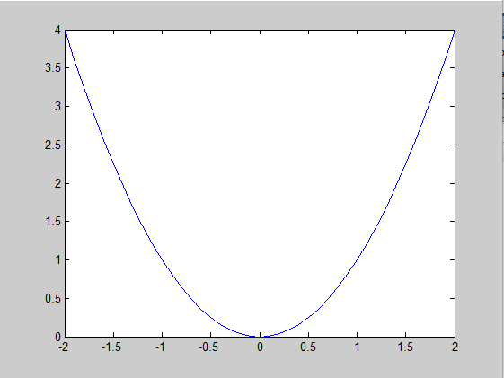
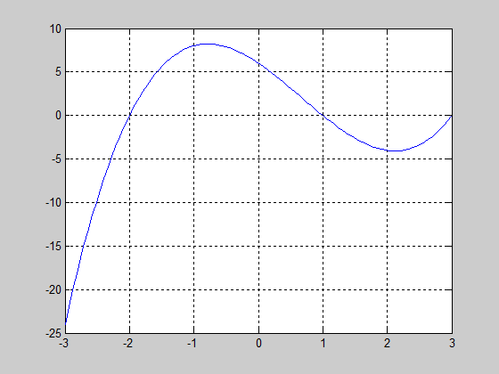
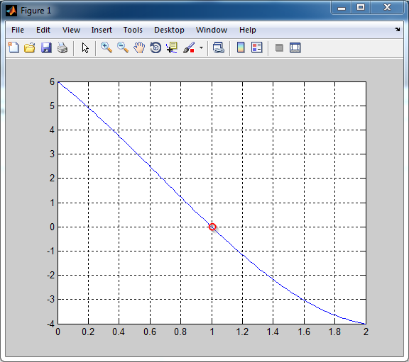
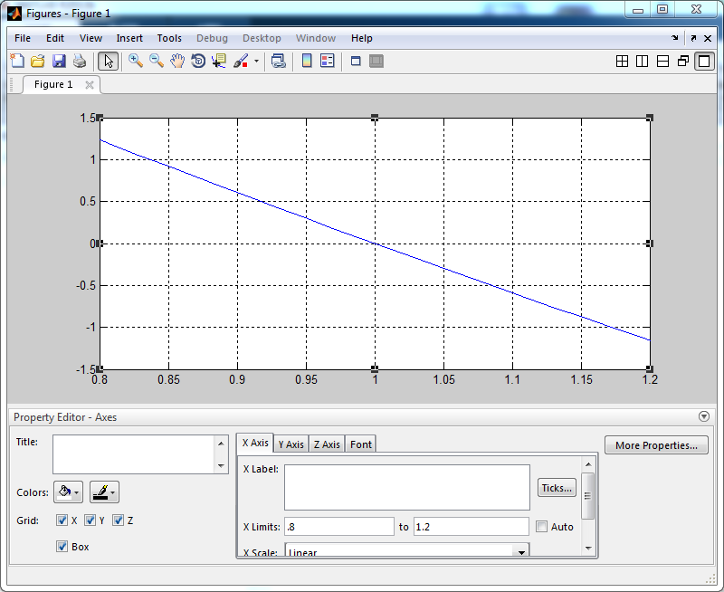
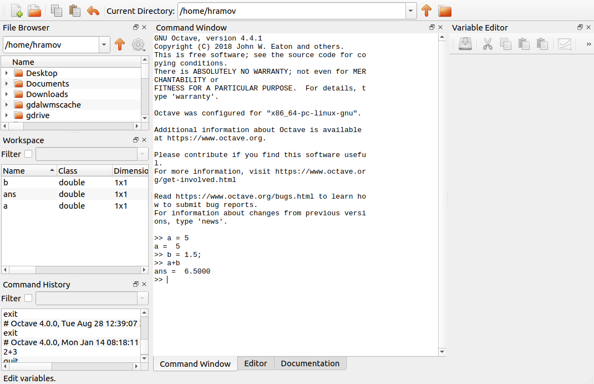

## Научные вычисления

* **Научные вычисления** (scientific computing, сomputational science) — решение научных задач с помощью компьютеров. 
* Задачи чаще всего относятся к области естественных наук (физики, химии, биологии и др.) или к математике.
* Научные вычисления называют “третьим столпом науки”, наряду с теоретическим анализом и экспериментами.
* Грань между научными вычислениями и науками, являющимися источниками задач, проходит между интересом к методам решения задач и решением самих задач.

Компьютер позволяет выполнять расчеты:

* быстрее;
* дешевле;
* иным способом, чем это было в "докомпьютерную эпоху".


## Научные вычисления: как это делается

Научные вычисления предполагают:

* создание математической модели явления — приближенного описания явления на языке математики,
* реализацию модели на языке программирования,
* выполнение расчетов,
* проверку правильности результатов.


## Необходимые знания и навыки

* *Математика*
* Программирование
* Вычислительные методы
* Математическое моделирование


## MATLAB




## Интерфейс MATLAB




## Окна

* **Командное окно** (Command Window) — набираем команды и нажатием *Enter* отправляем их на выполнение.
    * *Shift-Enter* — перевод строки
    * `clc` — очистка командного окна
    * $\uparrow$, $\downarrow$ — перемещение по истории команд
* **Рабочая среда** (Workspace) — просмотр содержимого памяти.
    * `clear` — очистка содержимого памяти
* **История команд** (Command History).


## Рабочая среда (Workspace)




## *Ctrl+N* - вызываем редактор




## Операции в порядке приоритета

Операция | Описание
---------|------------
`()`     | изменяют приоритет операций
`'`      | транспонирование
`^`      | возведение в степень
`.^`     | поэлементное возведение в степень
`\`      | матричное деление
`*`, `/` | умножение, деление
`.*`, `./` | поэлементное умножение, поэлементное деление
`+`, `-` | сложение, вычитание


## Переменные

\small

```
a = 3.5 % Переменная = Значение[;]
b3 = 1
A = 6
```

';' – ставят после промежуточных вычислений для подавления вывода в командное окно или для разделения команд в одной строке.

Язык MATLAB – РЕГИСТРОзависимый.

`ans` (от *answer*) – имя "анонимной" переменной.

`%` – начало комментария.

Синтаксис переменных: 

* латиница, цифры, знак подчеркивания, 
* начинается с буквы, 
* кроме зарезервированных слов (for, end, if, else, case,...). 

**Внимание! Правила относительно имен переменных распространяются на функции, а также на файлы и папки.**


## Задача 1. Какие из следующих имен переменных являются допустимыми?

\label{t01}

1.	`a`
2.	`B`
3.	`ecky_ecky_ecky_ecky_ptang_zoo_boing`
4.	`ecky ecky ecky ecky ptang zoo boing`
5.	`2nd`
6.	`Vasya`
7.	`Вася`
8.	`John-Bigboote`


## Типы данных

Все числовые переменные по умолчанию имеют тип `double` – 8 байт. Поэтому нет необходимости указывать тип переменных. Однако в языке есть функции для явного приведения типов.

Другие типы данных: 

* Строковые: `'Hello world'`, `'Aren''t you crazy?'` — выражение в одинарных кавычках является строковой переменной.
* Комплексные числа: `z = 3+6i`.


## Матрицы

* Все числовые переменные в MATLAB — это матрицы.
* MATLAB = MATrix LABoratory.
* Скаляр — матрица размерности 1х1.

```
a = [1 2 3 4 5 6 7 8 9]   % матрица 1х9
b = [1,2,3,4,5,6,7,8,9]'  %         9х1
A = [1 2 3; 4 5 6; 7 8 9] %         3х3
```

* Матрицы записываются по строкам
* Строки разделяются ";"
* Столбцы разделяются пробелами или ","

```
A = [1 2 3; 
     4 5 6; 
     7 8 9]
```


## Обращение к элементам

* Нумерация элементов начинается с 1.

```
a = [1 2 3 4 5 6 7 8 9]
a(1)     % первый элемент
a(end)   % последний элемент
a(3:5)   % элементы с 3-го по 5-й
a([5,7]) % элементы 5-й и 7-й
```

* двоеточие `:` задает диапазон изменений — `с:по`

```
x =  начало:шаг:конец;
```
```
a = 1:9    % 1 2 3 4 5 6 7 8 9
b = 1:3:9  % 1 4 7
c = 9:-2:0 % 9 7 5 3 1
```


## Задача 2.

\label{t02}

* Создать вектор `v` из чисел `-5,-3,-1,1,3,5`.
* Вывести на экран элементы  `v` с 3-го по 5-й.
* Заменить их числами `0,1,2`
* Вывести на экран полученный вектор

**Примечания:**

* Экран = Command Window
* Выводить нужно только то, что указано в задании (`;`).


## Поэлементные операции

\small

MATLAB трактует `*, /, ^` как операции, выполняемые по правилам линейной алгебры.

```
x = [1 2 3];
y = [3 4 5];
x * y
```
Дает:
```
Error using  * 
Inner matrix dimensions must agree.
```

Для выполнения операций над отдельными элементами матриц нужно поставить перед знаком нужной операции точку: `.*, ./, .^`


```
x .* y
```
```
ans =

     3     8    15
```


## Элементарные функции

```
sin(x), cos(x), tan(x), cot(x), 
sqrt(x), 
exp(x), log(x), log10(x)
```

* Аргументы тригонометрических функций задаются в радианах.
* Найти `x` радиан по заданным `d` градусам можно с помощью пропорции:
`x/d = pi/180`, т.е. `x = d*pi/180`.
* Аргументы тригонометрических функций `cosd()`, `sind()` задаются в градусах.


## Задача 3. Предельная скорость спуска парашютиста

\label{t03}

Предельная скорость спуска парашютиста зависит его веса, расположения тела во время прыжка, плотности воздуха, и задается формулой

$$
V_t = \sqrt{\frac{2 m g}{r A C_d}} ,
$$

где $m$ — масса парашютиста; $g$ — ускорение свободного падения; $r$ — плотность атмосферы; $A$ — площадь поверхности парашюта; $C_d$ — коэффициент лобового сопротивления парашюта.

Вычислите предельную скорость спуска для парашютиста массой 70 кг. Остальные величины имеют следующие значения: $g = 9.8$ м/с$^2$ — ускорение свободного падения; $r = 1.2$ кг/м$^3$ — плотность атмосферы; $A = 0.5$ м$^2$ — площадь поверхности парашюта; $C_d = 1$.

*Какую размерность имеет $C_d$?*


## Задача 4. Операции со строками

\label{t04}

Ввести строки `s1` (ваше имя, латинскими буквами) и `s2` (ваша фамилия, латинскими буквами). При необходимости дополнить строки пробелами так, чтобы длины s1 и s2 совпадали. Длину строки можно узнать в окне **Workspace** или с помощью функции `length`.

Выполнить над `s1` и `s2` следующие действия:

1. `si = [s1 s2]`
2.`sii = [s1; s2]`
3. `siii = si’`
4. `siv = si(end:-1:1)`

Сохранить код в файле `lab01_4.m`.


## Строим график

```
x = -2:.1:2;
y = x.^2;
plot(x,y)
```




## Задача 5.

\label{t05}

* Построить график функции $y = \frac{x^3 - 0.3x}{1+2x}$ на интервале $[0,3]$ с шагом 0.1.
* Построить график этой же функции на интервале $[-2,3]$. Что при этом происходит?


## Пример. Поиск корней уравнения

Найдем корень уравнения
$$
x^3-2x^2-5x+6=0,
$$
расположенный на промежутке $[0;2]$ с точностью до 0.01.


## Строим график




## Ограничиваем область поиска корня




## Сужаем окрестность корня (XLimits) пока не достигнем нужной точности




## Задача 6. Найти корень уравнения

\label{t06}

$$
x^3-x^2-5x+6=0,
$$
расположенный на промежутке $[1;1.5]$ с точностью до 0.01.

*Совет:* сделайте шаг по `x` по крайней мере в 10 раз меньше, чем требуемая точность (0.001).

<!-- 1.305 -->


## Специальные значения

Бесконечности:
``` 
Inf = 1/0 
-Inf = -1/0 
```

Not-a-Number:
```
NaN = 0/0
```

Математические константы:
```
pi
e = exp(1)
```


## Бесплатная альтернатива MATLAB

* [GNU Octave](https://www.gnu.org/software/octave/)
* [Scilab](https://www.scilab.org)
* Python + NumPy + SciPy
* [Julia](https://julialang.org)


## Интерфейс GNU Octave




## Информационные ресурсы

1. Ануфриев И.Е. и др. MATLAB 7.
2. Хант Б. и др. MATLAB R2007 с нуля!
3. MATLAB: язык технических вычислений.
4. matlab.exponenta.ru
5. [dkhramov.dp.ua: m-файлы примеров](http://dkhramov.dp.ua/Sci.M-files.html)

### Вспоминаем математику

* Бёрд Дж. Инженерная математика: Карманный справочник. М.: Издательский дом «Додэка-ХХI», 2008. 544 с.

### Где искать книги

* Папка `/lit`
* [Library Genesis: gen.lib.rus.ec](http://gen.lib.rus.ec)


## Источники

* [Gatlinburg VII Conference on Numerical Linear Algebra, December 11 - 17, 1977, Asilomar, California. From an album of photographs taken by Walter Gander](http://www.maths.manchester.ac.uk/~higham/photos/gatlinburg7/gatlinburg7_011.htm) — фото Клива Молера.


## Список задач

\Large

* \hyperlink{t01}{Задача 1}
* \hyperlink{t02}{Задача 2}
* \hyperlink{t03}{Задача 3}
* \hyperlink{t04}{Задача 4}
* \hyperlink{t05}{Задача 5}
* \hyperlink{t06}{Задача 6}


## Контактная информация

\centering

**Преподаватель**: Храмов Дмитрий Александрович, доцент, к.т.н.

**e-mail**: `dkhramov@mail.ru`

**веб-сайт**: [dkhramov.dp.ua](http://dkhramov.dp.ua/)

**skype **: `d_khramov`
