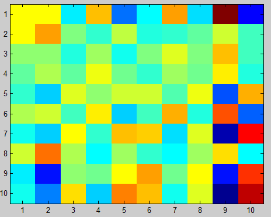
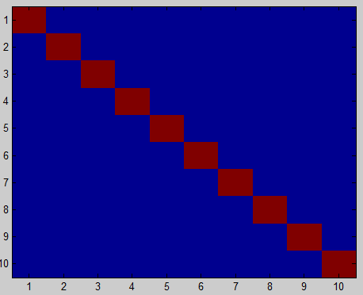

# 1. Массивы


## Обращение к элементам массива

Массив формируется по строкам:

`A = [1,2,3; 4,5,6;7,8,9];`


```
A(1,2)      % элемент 1-й строки и 2-го столбца (2)
A(:,1)      % 1-й столбец
A(2:3,:)    % строки 2 и 3
A(3,c(1,3)) % элементы 1-го и 3-го столбца 3-й строки
A(5)        % ?  
```


## Создание массивов: [], eye

\footnotesize

```
>> A = []

A =

     []

>> B = eye(2)

B =

     1     0
     0     1

>> B1 = eye(2,3)

B1 =

     1     0     0
     0     1     0
```


## Создание массивов: ones, zeros

\footnotesize

```
>> C = ones(2)

C =

     1     1
     1     1

>> D = zeros(1,3)

D =

     0     0     0
```


## Создание массивов: rand

\small

`rand()` создает случайную величину, равномерно распределенную на интервале [0;1].

\footnotesize

```
>> rand

ans =

    0.8147

>> rand(2,1)

ans =

    0.9058
    0.1270
```    

\small
Случайная величина, равномерно распределенная на интервале [a;b]:

\footnotesize

```
ab = a + (b-a)*rand()
```


## Задача 1. 

\label{t01}

Создать заданную матрицу `A`, воспользовавшись только числами, арифметическими действиями и функциями `zeros`, `ones`, `eye`.


## Задача 2. 

\label{t02}

Создать заданную матрицу `B`, воспользовавшись только числами, арифметическими действиями и функциями `zeros`, `ones`, `eye`.


## Удаление строк и столбцов массива

```
A = [1,2,3; 4,5,6; 7,8,9];
A(:,1) = 0;  % обнуление 1-го столбца
A(:,1) = []; % удаление 1-го столбца
```


## Объединение матриц

```
x = (1:0.1:2)';
logs = [x log(x)]

logs =

    1.0000         0
    1.1000    0.0953
    1.2000    0.1823
    ...       ...
```
```
A = [1,2,3];
A = [A,4];   % сообразуясь с формой массива!
```


## Еще о задании векторов

```
v = 1:0.1:2
```

Сколько элементов в `v`? Ответ даст `length(v)`.

Создадим вектор из 10 элементов в диапазоне от [1;2]:

```
u = linspace(1,2,10)
```

\scriptsize

```
u =

  Columns 1 through 8

    1.0000    1.1111    1.2222    1.3333    1.4444    1.5556    1.6667    1.7778

  Columns 9 through 10

    1.8889    2.0000
```


## Создание многомерных массивов

```
A = [5 7 8; 0 1 9; 4 3 6];
```

3-е измерение уже есть! `A(:,:,1)` — это та же самая матрица `A`.

Добавим в 3-е измерение `A` еще один слой:

```
A(:,:,2) = [1 0 4; 3 5 6; 9 8 7];

size(A)

ans =

     3     3     2
```


## Создание многомерных массивов: cat()

cat (*conCATenation*) объединяет матрицы `A` и `B` вдоль измерения `dim`:

```
C = cat(dim, A, B)
```
```
A = [1 2; 3 4];
B = [5 6; 7 8];

c1 = cat(1, A, B)
c1 = [1 2; 3 4; 5 6; 7 8]

c2 = cat(2, A, B)
c2 = [1 2 5 6; 3 4 7 8]

c3 = cat(3, A, B)
size(c3) % 2x2x2
```


## Пример: обработка изображений

```
% загрузим картинку
A = imread('lena.png');
% покажем ее
imshow(A)
% превратим изображение в монохромное
A(:,:,[1,2]) = [];
figure
imshow(A)
```


##


##


## Изменение формы массива: reshape

Синтаксис: `Y = reshape(X,M,N)`

* Преобразование формы идет по столбцам (колонкам).
* M, N — количество строк и столбцов соответственно в формируемом массиве.
* Число элементов в массивах X и Y должно совпадать.

```
A = [1 2 3; 4 5 6];
B = reshape(A,3,2)
B = [1 5; 4 3; 2 6]
```


## Еще операции над массивами… 

**Размеры**

* `length(x)` — длина вектора;
* `[i,j] = size(A,dim)` — размерность матрицы;
* Создать матрицу того же размера, что и А: `B = ones(size(A))`.

**Максимумы/минимумы**

* `max, min` — для матрицы: поиск максимальных (минимальных) элементов по столбцам;
* max(max(A)) — максимум для матрицы A. 

**Другое**

* `sum, prod` — сумма и произведение элементов массива;
* `round` — округление, `fix` — усечение.


## Обращение матриц: inv

```
A = rand(10) % создадим случайную матрицу размера 10х10
Ai = inv(A); % обратим её
E = A*Ai;
```


## imagesc(A)


## imagesc(Ai)




## imagesc(E)




## Задача 3.

\label{t03}

Из элементов матрицы A, составить матрицу B, используя только операции выделения диапазона (:) и транспонирования (') и вывести ее на экран. Сохранить текст программы в m-файле.


## Задача 4.

\label{t04}

Пусть `x` — одномерный массив. Верно ли записано на языке MATLAB математическое выражение? Если нет, то исправить ошибку.


## Задача 5.

\label{t05}

При движении тела, брошенного под углом к горизонту, координаты тела изменяются по закону

$$
\begin{array}{lcl}
  \dot x &=& x_0 + v_0 t \cos\alpha, \\
  \dot y &=& y_0 + v_0 t \sin\alpha - \frac{g t^2}{2}, 
\end{array}
$$

* $(x_0,y_0)$ — координаты точки старта — (0,0);
* $v_0$ — начальная скорость движения тела — 20 м/с;
* $\alpha$ — угол бросания — 35 градусов к горизонту;
* $g = 9.8$ м/с$^2$ — ускорение силы тяжести;
* $t$ — время.

Построить график движения тела для первых 2.3 секунд его полета.


# 2. Логическая индексация

## Логический тип данных, сравнения и операции

Логический тип данных (logical) представляет состояния ИСТИНА и ЛОЖЬ с помощью чисел 1 и 0 соответственно.

* **Сравнения:** `== (тождество), <, >, <=, >=, ~= (не равно)`
* **Операции:** `& (И), | (ИЛИ), ~(НЕ)`

**Важно!** `'=='` — тождество, а `'='` — присваивание.

\small

Есть еще `&& (И)` и `|| (ИЛИ)` — они применяются для скаляров и реализуют короткий цикл вычислений (второй операнд оценивается только в том случае, когда результат не определяется полностью первым операндом).


## Логическая индексация

Обращаться к элементам массива можно:

1. по их номерам (числовым индексам);
2. с помощью **логической индексации**.

  |  |  |  |  |  |
--|--|--|--|--|--|
A |6 |7 |8 |9 |10|
LI|0 |0 |1 |0 |1 |

Логический индекс (маска) — это массив, имеющий тот же размер, что и исходный A, но состоящий из 0 и 1. Единицы указывают на выбранные элементы исходного массива A.

Выберем 3-й и 5-й элементы массива A:

* A([3,5]))
* A([0,0,1,0,1])


## Это дает нам векторизацию условий

Пусть у нас есть массив D:
```
D = [-0.2 1.0 1.5 3.0 -1.0 4.2 3.14];
```

Выберем из него положительные элементы

```
D >= 0 

  ans =  0 1 1 1 0 1 1 
```

Положительные элементы D — 1, отрицательные — 0.

Сколько всего положительных элементов в D?

```
sum(D >= 0)
```

Выделим массив из положительных элементов D:

```
P = D(D>=0);
```


## Пример. Как оценить площадь фигуры


## Алгоритм оценки площади фигуры

\Large

1. Помещаем фигуру в другую, с известной площадью (прямоугольник).
2. Генерируем $n$ точек со случайными координатами внутри прямоугольника.
3. Подсчитываем, сколько точек попало внутрь фигуры $n_s$.

```
Площадь_фигуры = Площадь_прямоугольника*ns/n
```


## Пример. Вычисление $\pi$

\bcols
\column{.5\textwidth}

\column{.5\textwidth}

\ecols
$$
\frac{n_s}{n} \approx \frac{S_{circle}}{S_{square}} = \frac{\pi r^2}{a^2} \Rightarrow
$$
$$
\pi \approx 4\frac{n_s}{n}
$$
$a = 2r$ — длина стороны квадрата.


## Код

\Large

```
% Задаем число точек
n = 1e6;
% Генерируем точки внутри квадрата
x = rand(1,n);
y = rand(1,n);
% Задаем абсциссы четверти круга
fun = sqrt(1-x.^2);
% Счетчик попаданий внутрь окружности
ns = sum(y <= fun);
pi_ = 4*ns/n
```


## Выгода от логической индексации

Конструкция
```
ns = 0;
for i=1:n
    if y(i) <= fun(i)
        ns = ns + 1;
    end
end
```
заменяется на:
```
ns = sum(y <= fun);
```


## Think vectorized

Девиз Matlab: "Думай векторно" (Think vectorized), т.е. думай о массиве в целом, а не об отдельных элементах.

Благодаря логической индексации в Matlab реже используются условные операторы и циклы.

Замена условных операторов и циклов операциями над массивом в целом называется **векторизацией.**

**Но:** пишете как вам проще — чтобы это работало. Когда программа заработает правильно, будете думать об улучшениях.


## Задача 6.

\label{t06}

Используя логическую индексацию, запишите функцию
$$
y = \left\{
\begin{array}{ll}
+1, & \text{если } x \ge 0, \\
-1, & \text{если } x < 0.
\end{array}
\right.
$$
и продемонстрируйте ее работу на примере вектора
```
x = [1 -3 0 4 3 -5 -7];
```


## Список задач

\Large

* \hyperlink{t01}{Задача 1}
* \hyperlink{t02}{Задача 2}
* \hyperlink{t03}{Задача 3}
* \hyperlink{t04}{Задача 4}
* \hyperlink{t05}{Задача 5}
* \hyperlink{t06}{Задача 6}
