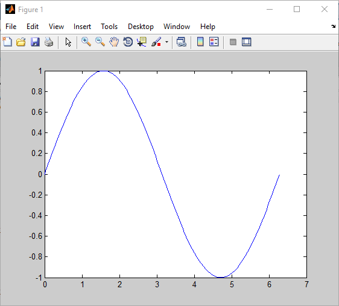
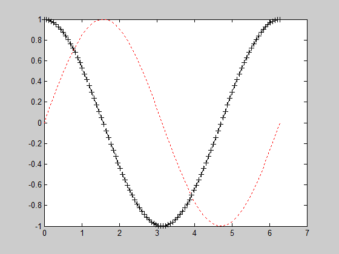
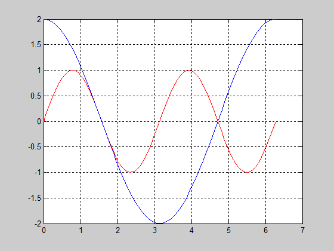
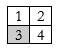
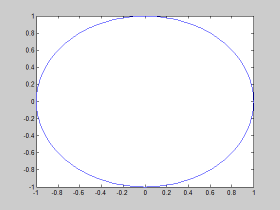
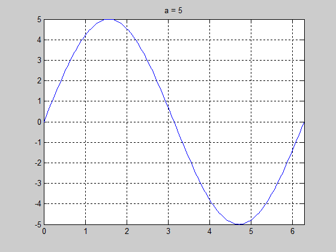
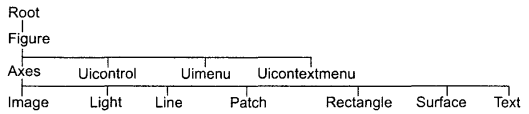
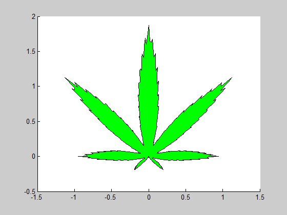
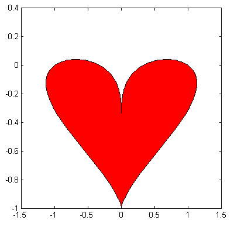

# Управление вычислительным процессом

## Виды вычислительных процессов

\small

1. **Линейный** -- все этапы решения задачи выполняются в порядке следования записи этих этапов.
2. **Ветвящийся** -- выбор направления обработки информации зависит от результатов проверки выполнения логического условия.
3. **Циклический** -- содержит многократно повторяемый участок вычислений (цикл).

По количеству выполнения циклы делятся на:

* **циклы со счетчиком**, т.е. заранее заданным числом повторений
* **циклы с условием**. Количество повторений заранее не определено и зависит от соблюдения некоторого логического условия.
    * цикл с предусловием -- условие проверяется в начале цикла;
    * цикл с постусловием -- условие проверяется в конце цикла.

    
## Условный оператор if – выбор из вариантов

Синтаксис:

```
if усл1
  действия1   % выполняются, если  усл1 == 1
 [elseif усл2
    действия2 % выполняются, если усл1 == 0, но усл2 == 1]
    ...
 [else
    действия3]
end
```

**Не забываем про отступы в коде!**

Короткий вариант:

```
if усл1 действия1, else действия2, end
```


## Пример: решение квадратного уравнения

```
a = ..; b =..; с = ..;
D = sqrt(b^2 – 4*a*c);

if D > 0
    x(1)=..; x(2) = ..;
  elseif D == 0
    x = ..;
  else
    disp('корней нет');
end
```

disp() - "культурный" вывод значения в CW, а не присвоение безымянной переменной `ans`.


## Пример: проверка пороговых значений

```
x = 10;
minVal = 2;
maxVal = 6;

if (x >= minVal) && (x <= maxVal)
    disp('Значение попадает в заданный диапазон.')
elseif (x > maxVal)
    disp('Значение находится выше диапазона.')
else
    disp('Значение находится ниже диапазона.')
end
```

\footnotesize

*Источник:* https://se.mathworks.com/help/matlab/ref/if.html


## Пример: сравнение строк

```
reply = input('Хотите установить программу? (y/n): ','s');
if strcmp(reply,'y')
  disp(reply)
end
```

\footnotesize

*Источник:* https://se.mathworks.com/help/matlab/ref/if.html


## Пример: действия над массивами

```
A = ones(2,3);
B = rand(3,4,5);

if isequal(size(A),size(B))
   C = [A; B];
else
   disp('A and B are not the same size.')
   C = [];
end
```

\footnotesize

*Источник:* https://se.mathworks.com/help/matlab/ref/if.html


## Пример: проверка векторного условия

```
D = [-0.2 1.0 1.5 3.0 -1.0 4.2 3.14];

if D >= 0 disp('Positive'), else disp('Negative'), end


    Negative
```


## Резюме по if

\Large

* if в MATLAB нужен реже, чем в языках без векторизации -- он заменяется логической индексацией;
* if удобнее использовать для проверки скалярных условий;
* существует множество функций для составления скалярных условий.


## Функции составления условий: any, all

\scriptsize

```
limit = 0.75;
A = rand(5,1)

any_A = any(A > limit)
All_A = all(A > limit)
```
```
A =

    0.0975
    0.2785
    0.5469
    0.9575
    0.9649


any_A =

     1


All_A =

     0
```


## Функции составления условий: `is*`

\tiny

* iscell -- Determine if input is cell array
* ischar -- Determine if input is character array
* iscolumn -- Determine whether input is column vector
* isdir -- Determine if input is folder
* isempty -- Determine if input is empty array
* isequal -- Determine if arrays are numerically equal
* isequaln -- Determine if arrays are numerically equal, treating NaNs as equal
* isevent -- Determine if input is Component Object Model (COM) object event
* isfinite -- Detect finite elements of array
* isfloat -- Determine if input is floating-point array
* isglobal -- Determine if input is global variable
* ishandle -- Detect valid graphics object handles
* ishold -- Determine if graphics hold state is on
* isinf -- Detect infinite elements of array
* isinteger -- Determine if input is integer array
* isjava -- Determine if input is Java object
* iskeyword -- Determine if input is MATLAB keyword
* isletter -- Detect elements that are alphabetic letters
* islogical -- Determine if input is logical array
* ismatrix -- Determine whether input is matrix
* ismember -- Detect members of specific set
* isnan -- Detect elements of array that are not a number (NaN)
* isnumeric -- Determine if input is numeric array
* isobject -- Determine if input is MATLAB object
* ispc -- Determine if running MATLAB for PC (Windows®) platform
* isprime -- Detect prime elements of array
* isreal -- Determine if all array elements are real numbers
* isrow -- Determine whether input is row vector
* isscalar -- Determine if input is scalar
* issorted -- Determine if set elements are in sorted order
* issparse -- Determine if input is sparse array
* isstruct -- Determine if input is MATLAB structure array
* isvector -- Determine if input is vector
* ...


## Задача 1.

\label{t01}

В США оценки ставятся в баллах: от 0 до 4 (4 ставится отличникам, а 0 — двоечникам). Числовым баллам соответствуют буквенные оценки:

Баллы	              | Оценки
--------------------|--------
от >= 3.5 до 4	    | A
от >= 2.5 до < 3.5	| B
от >= 1.5 до < 2.5	| C
от >= 0.5 до < 1.5	| D
< 0.5 	            | F

Составьте программу, которая по заданному числу баллов выводит на экран соответствующую им оценку. Ввод данных пользователем организуйте с помощью функции `input`, проверку — оператором `if`, а вывод — при помощи `disp`.


## Оператор множественного выбора switch

`switch` — выполняет ветвления, в зависимости от значений некоторой переменной или выражения.

**Внимание!** *выражение* -- это обязательно скаляр или строка.

```
switch выражение
  case значение1
    % выполняются, если <выражение> = <значение1>
    действия 1
  case значение2
    % выполняются, если <выражение> = <значение2>
    действия 2
  ...
  otherwise
    % выполняются, если <выражение> не совпало 
    % ни с одним из значений
    действия
end
```


## Оператор множественного выбора switch (2)

switch сравнивает значение выражения со значениями групп case. 

Для числовых выражений оператор case выполняется, если `<значение>== <выражение>`. Для строковых выражений case выполняется, если `strcmp(значение, выражение)` истинно.

Пример: переменная dice (игральная кость) принимает значения 1,2,...,6. В зависимости от этого выполняются те или иные действия.


## Пример: выбор типа графика

```
x = [12, 64, 24];

plottype = 'pie';

switch plottype
    case 'bar' 
        bar(x)
        title('Столбчатый график')
    case 'pie'
        pie3(x)
        title('Круговая диаграмма')
        legend('First','Second','Third')
    otherwise
        warning('Неизвестный тип графика.');
end
```
 
  
## В switch выполняется первый совпадающий case:

```
result = 52;

switch(result)
   case 52
      disp('result is 52')
   case {52, 78}
      disp('result is 52 or 78')
end
```

Результат выполнения:
```
      result is 52
```


## Цикл с условием: while

```
while условие
  % выполняются, пока условие истинно. проверка — в начале
  действия
end
```

**Краткая форма:** `while условие, действия, end`

**Совет.** Ищите повторяющиеся действия. Запишите решение без цикла, шаг за шагом. Описав таким образом два или три шага, вы сможете увидеть, какое действие повторяется. Оно и будет телом цикла.


## Пример: простой процент

```
si = 100;      % исходный вклад
np = 0.19;     % норма процента
s = si; i = 0;

while s <= 200 % пока сумма на счету <= 200
  s = s + si*np;
  i = i + 1;
end

disp([s,i])
```


## Задача 2.

\label{t02}

Какие значения выведет на экран следующая программа?

```
n = 1;
a = 1;
while a < 100
    n = n + 1;
    a = a * n
end
```


## Задача 3.

\label{t03}

\Large

Начальный вклад клиента в банк составляет 100000 грн., процент годового дохода — 12%. 

Определите, через сколько лет сумма на счете клиента вдвое превысит начальный вклад.


## Цикл со счетчиком: for

Переменной цикла присваиваются значения из заданного набора.

```
for переменная = начало : шаг : конец
  действия
end
```

Вариант цикла for, когда переменная цикла уменьшается:

```
for i = 10:-1:1
     действия
end
```

Однострочник:

```
for переменная = начало:шаг:конец, действие, end
```


## Пример: простой процент с заданным сроком вклада

```
si = 100;      % исходный вклад
np = 0.19;     % норма процента
n = 6;         % число лет действия вклада
s = si;        % сумма на счету

for i = 1:n
    s = s + si*np;
end
```

## Пример: вычисление суммы ряда

Найти сумму элементов ряда
$$
\sum_{n=1}^{100} \frac{1}{n^2} \left( \frac{n+1}{n} \right)^n
$$

```
n = 100;
series = 0;

for i=1:n
    p = (((i+1)/i)^i)/(i^2);
    series = series + p;
end

disp(series)
```

Результат:
```
3.5238
```


## Вложенные циклы

```
for i = 1:n

  for j = 1:m
    действия1;
  end
  
  while условие
    действия2;
  end
  
end
```


## Задача 4.

\label{t04}

Вычислить сумму

$$
s = \sum_{i=1}^{20} \sum_{j=1}^{20} \frac{(-1)^{i+j}}{(2i+j)^2} .
$$


## Экстренный выход из цикла

* `break` — выход из цикла. Во вложенных циклах выходит из только из внутреннего. break вне цикла прекращает выполнение скрипта или функции.
* `continue` — передает управление в следующую итерацию цикла, пропуская операторы, которые записаны за ним, причем во вложенном цикле он передает управление на следующую итерацию основного цикла.


## Пример: прерывание цикла с помощью break

```
a = 10;

while (a < 20)
  fprintf('Значение a: %d\n', a);
    a = a+1;
    if (a > 15)
      break;
    end
end
```


## Пример: пропуск итераций (continue)

```
a = 10;

while a < 20
  if a == 15
    % пропустить итерацию цикла
    a = a + 1;
    continue;
  end
  fprintf('Значение a: %d\n', a);
  a = a + 1;
end
```


## Задача 5.

\label{t05}

Векторизовать (записать без использования циклов) следующий код:

```
dx = 1/(n-1);
x = 0:dx:1;
f = zeros(1,n);

for i = 2:n
    f(i) = f(i-1)+dx*x(i-1);
end
```

n — произвольное натуральное число.


## Задача 6.

\label{t06}
\Large

Составьте программу для вычисления суммы ряда: 

1 - 1/2 + 1/3 - 1/4 + .... + 1/9999 - 1/10000.


## Резюме: операторы цикла

* Цикл с условием удобно использовать, когда неизвестно, сколько раз нужно повторять действие (это зависит от проверяемого условия). Цикл со счетчиком используют, когда действие выполняется заданное число раз.
* В `while` условие должно обязательно меняться внутри цикла, иначе он будет бесконечным. В `for` переменная цикла в теле цикла не изменяется, иначе не получим заданного числа повторений.


# Двумерная графика

## plot(x,y,...) строит график зависимости y от x

Способы задания диапазона значений аргумента:

* с фиксированным шагом:
```
x = 0:pi/100:2*pi;
plot(x, sin(x))
```

* с заданным числом значений:
```
x = linspace(0,2*pi,200);
plot(x, sin(x))
```


##




## Предупреждение: график в виде сплошной линии не гарантирует точности вычислений! 

\Large

Настоящих точек ровно столько, сколько задано вектором аргумента. 

Между точками проводится линейная интерполяция. 

Она не заменяет добавления новых расчетных точек!


## Цвет кривых, стиль линии и маркер точки

По умолчанию `plot` рисует сплошные кривые с маркером '.', первая кривая - синего цвета.

Полный (почти) синтаксис `plot`:

```
plot(x,y,’ЦветСтильМаркер’)
```

’ЦветСтильМаркер’ – строка из символов, задающих цвет, стиль линии, и вид маркера точек.


## Цвета, стили, маркеры

**Цвет**

* ‘с’ (cyan) – голубой 
* ‘m’ (magenta) – фиолетовый
* ‘y’ – желтый
* ‘r’, ‘g’, ‘b’
* ‘w’ – белый
* ‘k’ – черный

**Стиль линии**

* ‘-‘ -- сплошная
* ‘--‘ -- штриховая
* ‘-.’ -- штрихпунктирная
* ‘:’ -- пунктирная	

**Маркер точки**

* ‘+’, ‘о’, ‘x’, ‘*’, ‘.’


## Цвета, стили, маркеры (2)

* Порядок расположения характеристик в строке – произвольный
* Может быть указана только часть характеристик, а остальные принимают значения по умолчанию:

```
'r--'  % красная штриховая, маркер точка
'cx'   % голубая сплошная, маркер крестик
'oy:'  % желтая пунктирная, маркер незакрашенный кружок
```


## Несколько графиков в общих осях координат

```
plot(x1,y1,’csm1’,x2,y2,’csm2’,...)
```

Пример: 

```
x = linspace(0,2*pi,100);
plot(x, sin(x),'r:', x,cos(x),'k--+')
```


##




## Добавление кривых на существующий график: hold on

* По умолчанию MATLAB рисует график, стирая существующий. 
* `hold on` закрепляет существующий график, позволяя добавить к нему новый.

```
x = linspace(0,2*pi,100);
plot(x, sin(2*x))
hold on
plot(x, 2*cos(x))
grid on
```

* `hold on` работает не только между `plot`’ами, но и между другими графическими функциями.
* `grid on` включает отображение сетки на графике, `grid off` -- отключает использование сетки.
* Пара `on/off` работает аналогично в других графических командах.


##




## Задача 7.

\label{t07}

Постройте графики функций
$$
f(x) = \sin^2 x - \cos x^2, \quad g(x) = x^2\sin3x
$$
на промежутке $[1; 2\pi]$ с шагом 0.01.

Постройте графики в общих осях координат. 

График `f(x)` — сплошная линия зеленого цвета, маркер — звездочка, `g(x)` — пунктирная линия красного цвета. 

На графиках построить сетку.


## Вывод графиков в одном графическом окне на разных координатных осях: subplot

* `subplot` разделяет графическое окно на матрицу, состоящую из m x n графиков, и делает график номер p текущим. 
* Графики нумеруются по строкам: начиная с первой строчки, слева направо и сверху вниз

```
subplot(2,2,3)
```




## Пример

```
x = 0:pi/100:2*pi;
subplot(2,2,1)
plot(x,sin(x))
subplot(2,2,2)
plot(x,cos(x))
subplot(2,2,3)
plot(x,3*sin(x))
subplot(2,2,4)
```


## Задача 8.

\label{t08}

Постройте графики функций
$$
f(x) = \frac{\sin x}{x+1}, \quad g(x) = e^{-x}\cos(x)
$$
на промежутке $[0; 2\pi]$ с шагом 0.01 в общем графическом окне на разных координатных осях. 

Кривая на первом графике должна быть зеленого цвета, на втором — желтого.

На графиках построить сетку.


## Создание графических окон: figure

* Если графическое окно не создано, `plot` создает его.
* Создать новое графическое окно можно самостоятельно.

```
x = 0:pi/100:2*pi;
plot(x, sin(x))
figure
plot(x, cos(x))
```

Создается два графических окна. В первом будет нарисована синусоида, во втором – косинусоида. 

Номер графического окна указан в заголовке окна (Figure 1, Figure 2).

Можно управлять выводом графиков в нужное окно. Так, если открыто несколько графических окон, то функция

```
figure(2)
```

делает активным 2-е окно и графики будут выводится в него.


## Функции настройки свойств графика

Все функции, управляющие свойствами графика, располагаются в программе после функции plot (или ей подобных). 

Принцип: сначала строим график, потом управляем его отображением.


## Управление свойствами осей координат: axis

```
axis([xmin xmax ymin ymax])
```

-- Устанавливает диапазон выводимых значений координат `x` и `y`.

Начало координат помещается в нижнем левом углу. Ось $X$ направлена вправо, ось $Y$ — вверх. Как в математике.

```
x = 0:pi/100:2*pi;
plot(x, sin(x))
axis([0 2*pi -1 1])
```


## Пример: единичная окружность

```
x = 0:pi/100:2*pi;
plot(exp(i*x))
```


## Отчего так?




## Команды axis

* `axis equal` –  устанавливает масштабы, который обеспечивает одинаковые расстояния вдоль осей. Ее можно использовать в предыдущем примере.
* `axis square` – устанавливает масштабы  и делает оси равной длины. Оси станут «квадратными».
* `axis on/off` – включает/отключает отображение осей координат. Удобно для вывода «художественных» рисунков.
* `axis ij` — помещает начало координат в верхний левый угол.
* `axis auto` – возвращает отображение осей в автоматический режим.
* `axis` — новое окно с «пустыми» осями.


## Текст и подписи к осям координат

Подписи к осям координат

```
xlabel('строка')
ylabel('строка')
```

Подписи отображаются в соответствии с американскими стандартами: в середине осей координат.

Вывод текста

```
text(x, y, ’текст’)
```

x,y – координаты точки, в которую выводится текст.


## Заголовок графика

```
title('заголовок')
```

Пример:
```
a = 5;
plot(x, a*sin(x)), grid on
axis tight
title(['a = ' num2str(a)])
```

* `num2str(x)` - конвертирует вектор x в строку символов.
*  Объединяем `'a = '` и результат `num2str(a)` в одну строку:
`['a = ' num2str(a)]`

Можно использовать различные шрифты, размеры символов, управлять их начертанием (полужирный, курсив), выводить греческие буквы и математические символы.


## 




## Задача 9. 

\label{t09}

Построить график кусочно-непрерывной функции
$$
y = \left\{
\begin{array}{ll}
\pi - \sin x, & -2\pi \le x \le -\pi , \\
\pi - |x|, & -\pi < x \le -\pi , \\
\pi - \sin^3 x, & \pi < x \le 2\pi .
\end{array}
\right.
$$

Подписать (`text`) каждую из частей функции ее формулой ($\pi$ в строке задается как `'\pi'`).

Придумать заголовок графика и указать его.


## Что происходит при выполнении plot

1. создается графическое окно (серая подложка с меню и панелями инструментов);
2. в окне создаются оси координат (белое пространство с осями), причем автоматически подбираются диапазоны изменения переменных (x от и до, y от и до);
3. в осях строится график.

На каждом этапе работы создается объект и требуемым образом изменяются его свойства. 

## Графические объекты (упрощенная схема)

\small



1. root (корень) — первичный объект (экран компьютера). В работе не используется.
2. figure (рисунок) — графическое окно. В окне можно разместить:
3. axes (оси) — координатные оси, а в них:
    * line (линия) — линия. Этот тип объектов задает кривая графики функции одной переменной.
    * text (текст) — текстовая надпись в заданном месте графика.
    
При вызове `plot` последовательно строятся объекты Figure, Axes, Line и изменяются их свойства.


## Замечание на будущее

Графические объекты можно использовать по отдельности, как кубики, создавая из них нужную конструкцию. Больше придется прописывать вручную, но такой подход гибче, а его результат работает быстрее, так как не задействованы избыточные возможности `plot`.

**Примеры:**

* [Настраиваем графики в MATLAB](http://dkhramov.dp.ua/Sci.SetPlotSettingsMATLAB)
* [Многоцветная линия](http://dkhramov.dp.ua/Sci.MultiColoredLine)


## Специализированные графики

\Large

Что может Excel, может и MATLAB. И даже больше.

* `bar(x,y)` -- cтолбчатая диаграмма
* `pie(x)` -- круговая диаграмма («пирог»)
* `hist(x)` -- гистограмма


## Графики в логарифмическом масштабе

```
semilogx(x,y)  % лог. масштаб по оси x
semilogy(x,y)
loglog(x,y)    % лог. масштаб по обеим осям
```

Такие графики очень удобны для построения экспоненциальных зависимостей. В таком масштабе подобные зависимости представляются прямыми линиями.

```
t = 1:100;
e2 = exp(2*t);
plot(t,e2(t)) % быстро растущая функция
semilogy(t,e2(t)) % прямая y = 2*t
```


## Специальные координаты

* polar(phi,rho) — полярные координаты; phi – угол, rho – радиус (векторы одинаковой размерности).


## С помощью полярных координат можно построить каннаболу



## и не только...




## Список задач

\Large

* \hyperlink{t01}{Задача 1}
* \hyperlink{t02}{Задача 2}
* \hyperlink{t03}{Задача 3}
* \hyperlink{t04}{Задача 4}
* \hyperlink{t05}{Задача 5}
* \hyperlink{t06}{Задача 6}
* \hyperlink{t07}{Задача 7}
* \hyperlink{t08}{Задача 8}
* \hyperlink{t08}{Задача 9}
