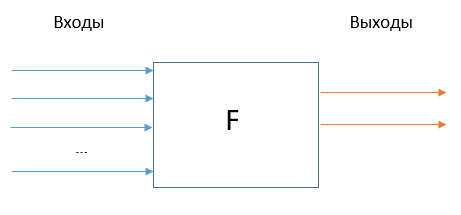
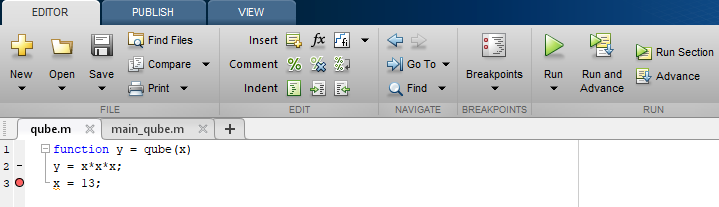
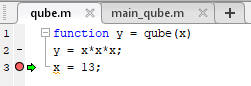
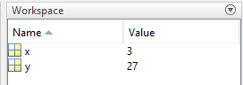
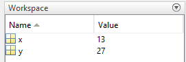
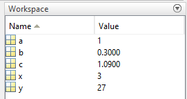

# Расширение возможностей языка: скрипты и функции

## 

Возникает необходимость многократного использование одних и тех же фрагментов кода — создаем скрипты (программы). 

Если код получается универсальным и нужен в разных программах — создаем подпрограммы.

**Подпрограмма** — поименованная часть компьютерной программы, содержащая описание определённого набора действий. Подпрограмма может быть многократно вызвана из разных частей программы и разных программ.


## Сохранение фрагмента скрипта в отдельном файле

\bcols
\begin{column}{0.5\textwidth}
\includegraphics[width=\textwidth]{images/scripts1.png}
\end{column}
\begin{column}{0.5\textwidth}
\includegraphics[width=0.95\textwidth]{images/scripts2.png}
\end{column}
\ecols


## Проблема

\Large

Недостаточная «изоляция» от остальной программы.


## Функции (процедуры)




## Синтаксис функций

```
function [y1,...,yN] = myfun(x1,...,xM)
% Что делает эта функция.
% X – массив входных параметров;
% Y – массив выходных параметров.
команды (тело функции)
````

* Сохраняется в файле `myfun.m`. *НИКАКОЙ КИРИЛЛИЦЫ В ИМЕНАХ!*
* Функции, сохраняемые в m-файлах, называют **m-функциями**.
* Хороший стиль: писать комментарии к функциям.
* Функции одной переменной: `function Y = myfun(X)`.


## А как же end?

* Не ошибетесь, если поставите.
* Обязателен, если функция находится в m-файле не одна. Например, при использовании субфункций.

Файл `stat2.m`:

```
function [m,s] = stat2(x)
n = length(x);
m = avg(x,n);
s = sqrt(sum((x-m).^2/n));
end

function m = avg(x,n)
m = sum(x)/n;
end
```

\tiny

*Источник:* https://se.mathworks.com/help/matlab/ref/function.html


## Задача 1. 

\label{t01}

Создайте функцию `squares`, реализующую сумму квадратов двух чисел. Сохраните ее в файле.

Создайте основной файл для вызова `squares()` и продемонстрируйте ее работоспособность.


## Формальные и фактические параметры функций

* Пространство имен скрипта и функции.
* Передача данных в функции выполняется **по значению**.
* Помните про соответствие типов параметров!
* Какой еще способ передачи параметров в функцию вы знаете?

Основной скрипт:
```
x = 3;
y = qube(x)
```

Функция qube:
```
function y = qube(x)
y = x*x*x;
x = 13;
```


## Точка останова (breakpoint)




## Запускаем основной скрипт






## Меню отладки


## Делаем еще один шаг




## Возвращаемся в основной скрипт




## Глобальные переменные

* Объявление `global` размещается в начале программы/функции.
* Задается в программах и в функциях, использующих общие глобальные переменные.

```
global x y z
% определяет переменные x,y,z как глобальные. БЕЗ ЗАПЯТЫХ!
```

* Риски: «несанкционированное» изменение глобальной переменной изнутри функции. 
* Проверка: `isglobal(x)`


## Пример

\small

Функция-"задаватель" значения глобальной переменной:
```
function setGlobalx(val)
global x
x = val;
```

Функция-получатель значения глобальной переменной:
```
function r = getGlobalx
global x
r = x;
```

Результат:
```
setGlobalx(328)
r = getGlobalx
r =

        328
```

У каждой функции своя область памяти (пространство имен).


## Объединение набора скалярных параметров в массив

Массив параметров — борьба с «перенаселенностью» списка аргументов функции.

Вместо:

```
function Y = transform(x,y,alpha,...)
```

делаем:

```
pars = [x,y,alpha,...];

function Y = transform(pars)
x = pars(1); y = pars(2); alpha = pars(3); …
…действия
```


## Анонимные функции или функции-однострочники

Синтаксис:

```
myfun = @(x,y,z,...) выражение
```

Пример:

```
sqr = @(x) x.^2;
sqr(2)


ans =

     4      
```


## Отладка функций

Основная ошибка при создании функций происходит при передаче данных. Поэтому

1. Проверьте правильность работы нужного фрагмента внутри программы, а затем выносите его в отдельную функцию. 
2. Проверьте правильность передачи параметров в функцию (выведите только что переданные параметры на экран). 

Тестируйте на маленьком примере, а затем переносите в большую программу.


## Задача 2.

\label{t02}

Создать функцию, реализующую вычисление $n$ первых чисел Фибоначчи. Числа Фибоначчи вычисляются по формуле:
$$
F_1=1, \quad F_2=1, \quad F_n=F_{n-1}+F_{n-2}.
$$


## Задача 3.

\label{t03}

Составьте m-функцию, которая по заданному вектору (одномерному массиву) определяет номер элемента этого вектора с наибольшим отклонением от среднего арифметического элементов вектора.


## Контроль аргументов функции

```
function y = pwfun(x)
% вычисляет значения функции
%     | 1-sin(x), x<-pi,
% y = | x,       -pi<=x<0,
%     | cos(2*x), x>=0.
% использование: y = pwfun(x), x - число
if x < -pi
    y = 1-sin(x);
elseif x >= -pi & x <0
    y = x;
else
    y = cos(2*x);
end
```

Что произойдет, если мы наберем `pwfun('s')` или если вместо скалярного аргумента будет использован массив?


## Добавим проверку

```
function y = pwfun(x)
if ~isnumeric(x) | ~isscalar(x)
    error('x - скаляр числового типа')
end
...
```

* `isnumeric` возвращает 1, если аргумент относится к одному из числовых типов данных.
* `isscalar` возвращает 1, если аргумент скалярный. 
* `error()` останавливает выполнение скрипта и возвращает сообщение об ошибке. error не даст никакого эффекта, если строка с сообщением об ошибке будет пустой.


## Предупреждения

Можно убедиться, что переменная `x` не относится к `NaN` или `inf`. 

В этом случае функция вернет значение `NaN` или `inf`, но пользователя стоит предупредить, что со значением `x` что-то не так.

Добавим:

```
if isnan(x) | isinf(x)
    warning('Аргумент – NaN или inf');
end
```

* `warning()` выдает предупреждение, но продолжает выполнение программы.
* `isnan` и `isinf` — проверка на принадлежность к NaN или к бесконечностям.


# Ввод/вывод данных

## Интерактивный ввод данных

**Ввод текстовых данных:**

```
A = input('Текст приглашения')
```

В CW появится строка с текстом приглашения. Пользователь вводит значение, которое сохранится в массиве A и жмет *Enter*.

**Ввод графических данных с помощью мыши:**

```
[X,Y] = ginput(N)
```

Открывает графическое окно, в котором указателем мыши можно отметить координаты точек. Эти координаты сохранятся в массивах `X` и `Y`. `N` (необязательный аргумент) — максимальное число вводимых точек. В конце работы с `ginput` жмем *Enter*.


## Вспомним о файлах

* Файл – именованный набор данных.
* Все файлы – бинарные "в глубине души".
* Текстовый формат: строки, разделенные признаком конца строки (CR+LF в Win).

**Что такое «Возврат каретки» (CR -- Carriage Return) и «Перевод строки» (LF -- Line Feed)?**


## Ввод/вывод данных из файла. Однородные данные

`dlmread/dlmwrite` — чтение/запись ASCII-данных из текстового файла с произвольным разделителем данных.

```
M = dlmread('имя','разделитель')
```

Разделители: пробел (по умолчанию), запятая, табуляция (`'\t'`).

```
dlmwrite('file.txt',M,'разделитель') 
```

матрица `M` записывается в файл `file.txt` с использованием заданного разделителя.


## Примеры

Построение графика по данным из файла:

```
Файл data.txt
0 1
1 2
…

M = dlmread('c:/temp/data.txt')
plot(M(:,1),M(:,2))
```

Запись строки в файл:

```
M = 'ababagalamaga';
dlmwrite('c:/temp/ data.txt',M,',')
```

Записывает в файл матрицу M, разделителем является пробел.


## Другие функции ввода/вывода. «Всё в одном»

* `csvread/csvwrite` — аналогично `dlmread/dlmwrite`, данные разделены запятой;
* `imread/imwrite` — графические файлы;
* `wavread/wavwrite` — аудиофайлы;
* `aviread/movie2avi` — видеофайлы;
* `xlsread/xlswrite` — файлы Microsoft Excel.


## Задача 4.

\label{t04}

В файле `Altitude.txt` записана траектория полета ракеты: в первом столбце — время в секундах, во втором — высота полета в метрах.

Составьте программу, считывающую данные из этого файла и строящую график зависимости высоты полета ракеты от времени.


## Задача 5.

\label{t05}

Составьте программу, которая:

* создает матрицу `A` размера 5х3, состоящую из случайных чисел, равномерно распределенных в интервале $[0;10]$;
* сохраняет ее в текстовом файле `data.txt` с разделителем `';'`;
* загружает эту матрицу в Workspace с помощью `dlmread()`.


## Задача 6.

\label{t06}

Составьте программу, которая:

* Считывает данные из таблицы `ExpData.xls`.
* Считывает данные из ячеек `B2:C4` листа `Лист2` той же таблицы.


## Ввод/вывод данных из файла: общий случай

**Основные операции:** открытие файла; чтение/запись; закрытие файла.

**Открытие/закрытие файла:**

`fid = fopen('имя','доступ')` — открывает файл и заносит идентификатор файла в переменную `fid`. Дальше мы работаем только со значением `fid`.

`status = fclose(fid)` — закрытие файла (в status заносятся сообщения о возможных ошибках).


## Доступ к файлу

|      |                                              |  
|------|----------------------------------------------|
|'rt'  | открывает текстовый файл для чтения          |
|'rt+' | открывает текстовый файл для чтения и записи |
|'wt'	 | создает пустой текстовый файл для записи     |
|'wt+' | создает пустой текстовый файл для чтения и записи |
|'at'	 | открывает текстовый файл для добавления информации в конец (если файла нет, он создается) |
|'at+' | открывает текстовый файл для добавления информации в конец или чтения |


## Пример

Откроем текстовый файл `data.txt` для чтения: 

```
fid = fopen('c:/temp/data.txt', 'rt')
```


## Чтение содержимого файла.

* `feof(fid)` — признак конца файла. `feof = 1`, если в файле больше нет строк и 0 в противоположном случае.
* `fgetl(fid)` — получение строки текстового файла с идентификатором `fid` без символа перевода строки.

```
f = fopen('c:/temp/data.txt','rt');
tfile = ''; % вначале массив строк пустой
while feof(f) == 0
    line = fgetl(f);
    tfile = char(tfile,line); % заносит line в массив строк
end
fclose(f);
disp(tfile)
```


## Массив строк. char()

`char(‘строка1’, ‘строка2’, ‘строка3’,...)` — возвращает массив строк вида:

```
строка1
строка2
строка3
```

Строки могут быть разной длины, char их дополнит пробелами до максимальной строки.

```
S = char(‘a’, ‘abc’, ‘ab’)
	a  
	abc
	ab 
```	

Размерность `S`: 3x3.


## Форматный вывод в текстовый файл

```
fprintf(fid, 'формат', x, y, z)
```

`fid` — идентификатор, `x,y,z` — список выводимых переменных. 

`формат` — список форматов (шаблонов вывода), указывающих на то, как именно выводить массив:

* `%s` --	строка символов (до пробела)
* `%f` --	число с фиксированной точкой
* `%e` --	число в экспоненциальном представлении: `1000 = 1e3`
* `%c` --	одиночный символ (в т.ч. пробел)

Форматы `\n`, `\t` служат для создания перехода на новую строку и добавления символа табуляции соответственно. 

Стандарт записи форматных строк: ANSI C.


## Ширина поля вывода

Можно задать максимальную ширину поля. 

Например `'%6.2f %12.8f'` будет выглядеть так:


* `%6.2f` — Всего 6 позиций, включая точку и знак числа. Из них 2 -- после точки.
* Затем, как и в формате, идет пробел.
* `%12.8f` — 12 позиций, 8 после точки.


## Вывод массивов

Если выводимые переменные — массивы, цикл для организации вывода не нужен.

Вывод массива осуществляется по столбцам. 

Создадим таблицу значений экспоненты в файле `exp.txt`:

```
x = 0:.1:1;
y = [x; exp(x)];
fid = fopen('exp.txt','wt');
fprintf(fid,'%6.2f %12.8f\n',y);
fclose(fid);
```

Получим:
```
  0.00   1.00000000
  0.10   1.10517092
...
```

## 

В строку формата можно помещать пробелы и обычный текст. 

Например:

```
fprintf(fid,'x = %6.2f exp(x) = %12.8f\n',y);
```

дает в `exp.txt`

```
x =   0.00 exp(x) =   1.00000000
x =   0.10 exp(x) =   1.10517092
```

## textread — считывание форматированных данных из файла

Чтение данных из файла `имя` и размещение его содержимого в переменных `A,B,C,….`

```
[A,B,C, ...] = textread('имя','формат')
```

Тип каждого аргумента определяется строкой `формат`. Если эта строка пуста, то будут считываться только численные данные.

`textread` удобно использовать, когда известен формат считываемого файла.


## Пример

Файл `data.txt` содержит данные вида:

```
Vasja    12.34 45 Yes
Fedja    23.54 60 No
Nikodim  34.90 12 No
```

Считаем данные из него в массивы

```
[names,x,y,answer] = textread('data.txt','%s%f%d%s');
```

Символы кириллицы в файле могут оказаться испорченными.


# Операции над файлами

##

* Открыть файл: `open('foo.m')`
* Удалить файл: `delete(‘имя_файла’)` или `delete имя_файла`.
* Есть еще `save`, `saveas`, `print`, …
* Список файлов в каталоге: `dir('имя_каталога')`
* Создать каталог (внутри текущего): `mkdir('имя_каталога')`
* Сменить рабочий каталог: `cd('новый_каталог')`
* Показать текущий рабочий каталог: `pwd`
* Показать текст файла на экране: `type список_файлов`


## Пример: просмотр имен всех файлов из заданной папки

```
files = dir;
for i=1:length(files)
  disp(files(i));
end
```

## Если вам захотелось прерваться…

**Сохранение переменных из Workspace на диск.**

* `save имя_файла` — сохраняет все содержимое Workspace в бинарный mat-файл `имя_файла.mat`. Эта информация затем может быть загружена функцией `load`.
* `save имя_файла x,y,z,..` — будут сохранены только переменные `x,y,z,..` В именах переменных можно использовать шаблон `'*'`.

**Загрузка данных с диска в Workspace.**

* `load имя_файла` — загружает все переменные, сохраненные в файле `имя_файла`. Это может быть бинарный файл с таким именем и расширением `.mat` или текстовый файл (с любым расширением или без него).
* `load имя_файла x,y,z,..` — загрузит только переменные `x,y,z,..` Можно использовать `'*'`.


## Список задач

\Large

* \hyperlink{t01}{Задача 1}
* \hyperlink{t02}{Задача 2}
* \hyperlink{t03}{Задача 3}
* \hyperlink{t04}{Задача 4}
* \hyperlink{t05}{Задача 5}
* \hyperlink{t06}{Задача 6}
