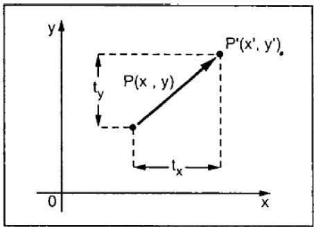
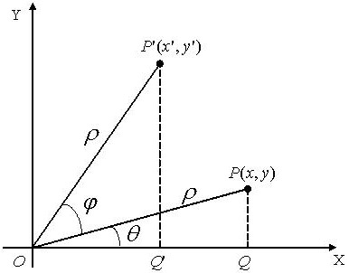
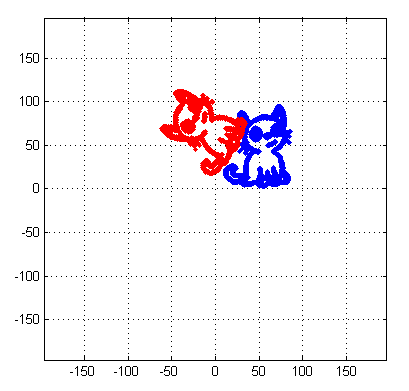
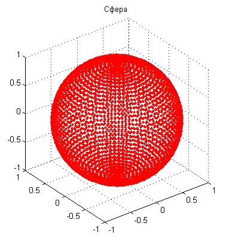
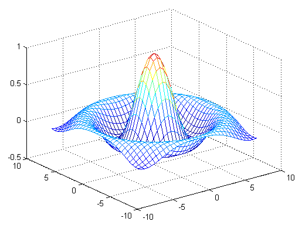
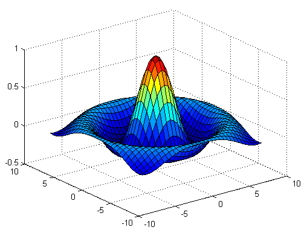
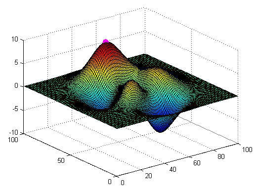

# Векторы, матрицы и преобразования координат

## Вектор


**Вектор** — математический объект, который характеризуется длиной и направлением.

**Вектор** $\vec{AB}$ — упорядоченная пара точек $A$ (начало вектора) и $B$ (конец вектора). 


## Система координат


Дает возможность ввести понятие координат вектора: $\vec{AB} = (x_2 - x_1, y_2 - y_1)$. 

**Внимание!** *В программировании, для краткости, "вектором" называют одномерный массив чисел. Такой массив действительно может представлять координаты вектора. Но сам вектор — это геометрический объект, который от выбора системы координат не зависит.*


## Длина вектора (норма)

\begin{center}
\includegraphics[width=0.35\textwidth]{images/vectors_triangle.png}
\end{center}
$$
||v|| = \sqrt{x^2 + y^2}
$$
```
p = [4,2];
norm(p)

ans =
      4.4721
```


## Скалярное произведение векторов (dot product)

$$
\vec{v} \cdot \vec{k} = ||\vec{v}|| \cdot ||\vec{k}|| \cdot \cos \theta
$$
$$
\begin{bmatrix} \color{red}{0.6} & -\color{green}{0.8} & \color{blue}0 \end{bmatrix} \cdot 
\begin{bmatrix} \color{red}0 \\ \color{green}1 \\ \color{blue}0 \end{bmatrix} = 
(\color{red}{0.6} \cdot \color{red}0) + (-\color{green}{0.8} \cdot \color{green}1) + (\color{blue}0 \cdot \color{blue}0) = -0.8 .
$$
```
v = [0.6,-0.8,0]; k = [0,1,0];
dot(v,k)

ans =

   -0.8000
```

## Векторное произведение векторов (cross product)

\begin{center}
\includegraphics[width=0.35\textwidth]{images/vectors_crossproduct.png}
\end{center}

```
cross(v,k)
```


## Координаты вектора в разных системах координат


В различных системах координат один и тот же вектор имеет разные координаты.

Трактовки преобразования координат:

1. Координаты вектора остаются неизменными, а изменяется система координат.
2. Изменяются координаты вектора, а система координат остается неизменной.


## Перенос (трансляция, translation)



## Связь новых координат со старыми

$$
\begin{array}{lll}
x' &=& x + t_x, \\
y' &=& y + t_y.
\end{array}
$$

Введем матричные обозначения

$$
P' = 
\left[
\begin{array}{l}
x' \\
y'
\end{array}
\right] ,
\quad
P = 
\left[
\begin{array}{l}
x \\
y
\end{array}
\right] ,
\quad
T = 
\left[
\begin{array}{l}
t_x \\
t_y
\end{array}
\right] .
$$

В матричной записи получим
$$
P' = P + T .
$$


## Поворот (rotation)




## Формулы для пересчета старых координат точки $P$ в новые $P'$

Пусть $Q$ и $Q'$ — проекции точек $P(x,y)$ и $P'(x',y')$ соответственно на ось $X$.

Тогда из прямоугольного треугольника $OP'Q'$ имеем:
$$
\begin{array}{l}
\displaystyle \cos (\theta+\varphi) = \frac{x'}{\rho}, \\
\displaystyle \sin (\theta+\varphi) = \frac{y'}{\rho}.
\end{array}
\Rightarrow
\begin{array}{l}
x' = \rho \cos (\theta+\varphi), \\
y' = \rho \sin (\theta+\varphi).
\end{array}
$$
Раскрывая суммы $\cos()$ и $\sin()$, получим
$$
\begin{array}{l}
x' = \rho \cos \theta \cos\varphi - \rho \sin \theta \sin\varphi, \\
y' = \rho \sin \theta \cos\varphi + \rho \cos \theta \sin\varphi.
\end{array}
\Rightarrow
\begin{array}{l}
x' = x \cos\varphi - y \sin\varphi, \\
y' = x \sin\varphi + y \cos\varphi,
\end{array}
$$
поскольку $x = \rho \cos \theta$, $y = \rho \sin \theta$.


## Формулы преобразования координат в матричной записи 

$$
\begin{array}{l}
x' = x \cos\varphi - y \sin\varphi, \\
y' = x \sin\varphi + y \cos\varphi,
\end{array}
$$

Вспомнив, что
$$
P' = 
\left[
\begin{array}{l}
x' \\
y'
\end{array}
\right] ,
\quad
P = 
\left[
\begin{array}{l}
x \\
y
\end{array}
\right].
$$
запишем формулы преобразования координат в матричном виде
$$
\left[
\begin{array}{l}
x' \\
y'
\end{array}
\right]
= 
\left[
\begin{array}{ll}
\cos\varphi & -\sin\varphi\\
\sin\varphi & \cos\varphi
\end{array}
\right]
\left[
\begin{array}{l}
x \\
y
\end{array}
\right].
$$
$$
P' = RP,
$$
где $R$ -- матрица поворота:
$$
R = \left[
\begin{array}{ll}
\cos\varphi & -\sin\varphi\\
\sin\varphi & \cos\varphi
\end{array}
\right] .
$$

## Пример. Преобразование координат изображения




## Код примера

```
A = imread('kitten.bmp');
[N,M] = size(A);
[i,j] = find(~A);
x = j; y = M-i;
plot(x,y,'.')
v = 2*max([N,M]);
grid on
axis([-v v -v v])
axis square
hold on

R = @(phi) [cos(phi),sin(phi); -sin(phi),cos(phi)];

a =-pi/3;
B = R(a)*[x';y'];
plot(B(1,:),B(2,:),'r.')
```

## Задача 1.

\label{t01}

Для любого из файлов *.bmp в папке `pics` последовательно выполнить следующие преобразования изображения: 

* поворот на угол 65$^\circ$;
* масштабирование с коэффициентами $s_x = 1$, $s_y = 1.5$;
* перенос начала координат на $t_x = 20$, $t_y = 30$.


## Матрица преобразования координат

Для произвольной матрицы A размерности 2 х 2 можно записать аналогично
$$
\left[
\begin{array}{l}
x' \\
y'
\end{array}
\right]
= 
\left[
\begin{array}{ll}
a_{11} & a_{12} \\
a_{21} & a_{22}
\end{array}
\right]
\left[
\begin{array}{l}
x \\
y
\end{array}
\right].
$$
или
$$
\left[
\begin{array}{l}
x' \\
y'
\end{array}
\right]
= A
\left[
\begin{array}{l}
x \\
y
\end{array}
\right] ,
$$

где $A$ -- матрица преобразования координат
$$
A = 
\left[
\begin{array}{ll}
a_{11} & a_{12} \\
a_{21} & a_{22}
\end{array}
\right] .
$$


## Масштабирование (scaling)

\bcols
\begin{column}{0.5\textwidth}
\includegraphics[width=\textwidth]{images/before_scaling.jpg}
\end{column}
\begin{column}{0.5\textwidth}
\includegraphics[width=\textwidth]{images/after_scaling.jpg}
\end{column}
\ecols

$$
\left[
\begin{array}{l}
x' \\
y'
\end{array}
\right]
= 
\left[
\begin{array}{ll}
S_x & 0 \\
0 & S_y
\end{array}
\right]
\left[
\begin{array}{l}
x \\
y
\end{array}
\right].
$$

## Отражение (reflection)

\includegraphics[width=0.75\textwidth]{images/reflection.jpg}

$$
\text{a)}
\left[
\begin{array}{l}
x' \\
y'
\end{array}
\right]
= 
\left[
\begin{array}{ll}
1 & 0 \\
0 & -1
\end{array}
\right]
\left[
\begin{array}{l}
x \\
y
\end{array}
\right]
\quad
\text{b)}
\left[
\begin{array}{l}
x' \\
y'
\end{array}
\right]
= 
\left[
\begin{array}{ll}
-1 & 0 \\
0 & 1
\end{array}
\right]
\left[
\begin{array}{l}
x \\
y
\end{array}
\right].
$$


## Последовательные преобразования

Пусть координаты точки $P(x,y)$ преобразуются сначала в координаты $P'(x',y')$ при помощи матрицы $B$, а затем в координаты $P''(x'',y'')$ при помощи матрицы $A$
$$
\left[
\begin{array}{l}
x' \\
y'
\end{array}
\right]
= B
\left[
\begin{array}{l}
x \\
y
\end{array}
\right] ,
\quad
\left[
\begin{array}{l}
x'' \\
y''
\end{array}
\right]
= A
\left[
\begin{array}{l}
x' \\
y'
\end{array}
\right] .
$$
Тогда матрица $C$, выполняющая преобразование от $P(x,y)$ к $P''(x'',y'')$,
$$
\left[
\begin{array}{l}
x'' \\
y''
\end{array}
\right]
= AB
\left[
\begin{array}{l}
x \\
y
\end{array}
\right]
\Rightarrow
\left[
\begin{array}{l}
x'' \\
y''
\end{array}
\right]
= C
\left[
\begin{array}{l}
x \\
y
\end{array}
\right] ,
$$
запишется в виде
$$
C = AB
$$
или
$$
C = 
\left[
\begin{array}{ll}
c_{11} & c_{12} \\
c_{21} & c_{22}
\end{array}
\right] = 
\left[
\begin{array}{ll}
a_{11}b_{11}+ a_{12}b_{21} & a_{11}b_{12}+ a_{12}b_{22} \\
a_{21}b_{11}+ a_{22}b_{21} & a_{21}b_{12}+ a_{22}b_{22}
\end{array}
\right] = AB .
$$

## Однородные координаты

Большинство операций по преобразованию координат выполняется умножением матриц, тогда как перенос -- суммированием.

Для единообразия, в компьютерной графике вводят однородные координаты для плоскости
$$
\left[
\begin{array}{l}
x \\
y
\end{array}
\right]
\Rightarrow
\left[
\begin{array}{l}
x \\
y \\
1
\end{array}
\right] ,
$$
а вместо матриц размерности 2 x 2 (для плоскости) используют матрицы размерности 3 x 3, что позволяет записать все преобразования, используя только умножение матриц. В том числе и перенос
$$
\left[
\begin{array}{l}
x' \\
y' \\
1
\end{array}
\right] = 
\left[
\begin{array}{lll}
1 & 0 & t_x \\
0 & 1 & t_y \\
0 & 0 & 1
\end{array}
\right]
\left[
\begin{array}{l}
x \\
y \\
1
\end{array}
\right] .
$$


## Некоммутативность умножения матриц

Выполним в разной последовательности масштабирование и перенос начала отсчета
$$
S = 
\left[
\begin{array}{lll}
S_x & 0 & 0 \\
0 & S_y & 0 \\
0 & 0 & 1
\end{array}
\right],
\quad
T = 
\left[
\begin{array}{lll}
1 & 0 & t_x \\
0 & 1 & t_y \\
0 & 0 & 1
\end{array}
\right] .
$$
Получим
$$
ST = 
\left[
\begin{array}{lll}
S_x & 0 & S_x t_x \\
0 & S_y & S_y t_y \\
0 & 0 & 1
\end{array}
\right],
\quad
TS = 
\left[
\begin{array}{lll}
S_x & 0 & t_x \\
0 & S_y & t_y \\
0 & 0 & 1
\end{array}
\right] .
$$

Тем не менее, произведение некоторых видов матриц коммутативно. Например, диагональные матрицы переставлять можно. Вспомним геометрический смысл осуществляемого ими преобразования. 


## Обратное преобразование

Преобразование, обратное тому, что осуществляется матрицей $A$ выполняется при помощи обратной к $A$ матрицы $A^{-1}$.

Для прямой и обратной матриц справедливо
$$
A A^{-1} = E , 
$$
где $E$ -- единичная матрица.


# Трехмерная графика

## Построение кривых и точек в пространстве

```
plot3(x,y,z)
```
`x`, `y` и `z` — векторы координат точек линии (равной длины): 
```
x = x(t), y = y(t),  z = z(t).
```

Функция `plot3` удобна для отображения точек данных. Нужно лишь поставить маркер «точка». Для этой же цели используется `scatter3`.


## Пример. Винтовая линия

Винтовая линия -- растущая вверх окружность единичного радиуса.
 
```
t = 0:pi/50:10*pi;
plot3(sin(t),cos(t),t)
grid on
```

\begin{center}
\includegraphics[width=0.5\textwidth]{images/screw.png}
\end{center}


## Задача 2

\label{t02}

Построить графики пространственных кривых

1)
$$
\begin{array}{lll}
x &=& \frac{a\cos t}{t}, \\
y &=& \frac{a\sin t}{t}, \\
z &=& at, \\
\end{array}
$$
где $a=2$, $\pi \le t \le 10\pi$.

2)
$$
\begin{array}{lll}
x &=& 10\cos t - 5\cos 2t, \\
y &=& 10\sin t - 5\sin 2t, \\
z &=& 10t ,
\end{array}
$$
$0 \le t \le 10\pi$.

Тип маркера -- "точка", цвет и стиль линии выбрать самостоятельно.

Сохранить текст программы в m-файле, а рисунок — в файле формата `*.fig`.


## Задача 3

\label{t03}

Загрузить координаты точек из файла `data.csv`. Отобразить точки при помощи `plot3` или `scatter3`.


## Пример. Построение графика единичной сферы с помощью окружностей

```
n = 50; m = 50;
t1 = -pi:pi/n:pi;
t2 = [-pi/2:pi/m:pi/2]';
X = cos(t2)*cos(t1);
Y = cos(t2)*sin(t1);
E = ones(size(t1));
Z = sin(t2)*E;
plot3(X,Y,Z,'r.'), grid, title('Сфера'), axis square
```

##




## Задача 4

\label{t04}

В рассмотренном выше примере построения графика единичной сферы добавить ввод параметров `n` и `m` с клавиатуры и установить стиль линии -- "сплошная". Задав по своему усмотрению `n` и `m`, построить единичную сферу.

Построить единичную сферу с помощью функции `sphere(n)`.

Сохранить код программы в файле.


## Поверхность в трехмерном пространстве

Задается функцией двух переменных: $z=f(x,y)$.

\begin{center}
\includegraphics[width=0.7\textwidth]{images/surface_ex2.png}
\end{center}

Каждой точке с координатами `x` и `y` соответствует «высота» `z` (значение функции). 


## Как задать область определения

Чтобы построить график функции одной переменной $y=f(x)$, мы изменяли аргумент $x$ с заданным шагом и вычисляли соответствующие значения функции $y$ (`linspace`).

В пространственном случае будем поступать аналогично -- строить сетку: изменять значения аргументов $x$ и $y$ с постоянным шагом и вычислять соответствующие значения функции $z$. 

Для простоты будем рассматривать только прямоугольные области определения.


## Пример. Построить график функции $z=x^2+y^2$ в области $0\le x \le 1$, $0\le y \le 1$ с шагом $0.5$.

\small

В традиционном языке программирования для вычисления значений функции понадобятся циклы

```
x = 0:0.5:1; y = 0:0.5:1;
for j=1:length(y)
  for i=1:length(x)
    Z(i,j)=x(i)^2+y(j)^2;
  end
end
…рисующая массив z функция…
```

Для MATLAB так тоже можно, но не эффективно: действия над массивом в целом реализуются быстрее, чем циклы по элементам. 

Но мы не можем записать `Z = x.^2 + y.^2`, поскольку массивы `x`, `y` — одномерные, а `Z` — двумерный (значения функции в узлах сетки).

Как быть?


##

\begin{center}
\includegraphics[width=0.5\textwidth]{images/grid.png}
\end{center}

```
X =[0 0.5 1;
    0 0.5 1;
    0 0.5 1];

Y =[0   0   0;
    0.5 0.5 0.5;
    1   1   1];
```


##

Строки матрицы X состоят из копий вектора x. Число этих копий равно числу элементов в векторе y.

Аналогично, y-координаты образуют матрицу Y. Здесь уже столбцы матрицы представляют собой y-координаты узлов сетки, а число столбцов равно числу элементов вектора x. 

Теперь каждому `Z(i,j)` соответствует `X(i,j)` и `Y(i,j)`:
```
x = 0:0.5:1; y = 0:0.5:1;
for j=1:length(y)
  for i=1:length(x)
     X(i,j)=x(j); Y(i,j)=y(i);
     Z(i,j)=X(i,j)^2+Y(i,j)^2;
  end
end
…рисующая массив z функция…
```


## meshgrid — формирование прямоугольной координатной сетки

```
[X,Y] = meshgrid(x, y)
```

`x`, `y` – векторы, задающие диапазоны изменения по осям Ox, Oy. `X`, `Y` — матрицы элементов сетки.

```
[X,Y] = meshgrid(0:1,0:1);
Z = X.^2 + Y.^2;  % поэлементное действие!
```


## Построение графиков функций двух переменных

График функции 2-х переменных -- это поверхность в пространстве.

Поверхности строятся одним из следующих способов:

* `mesh(X,Y,Z)` – проволочный каркас поверхности.
* `surf(X,Y,Z)` – грани, соединяющие ребра каркаса.

Каркас окрашен в зависимости от значения функции в данной точки. Например, большие значения функции окрашены в более теплые цвета (максимальное – в ярко красный), меньшие – в более холодные (наименьшее – в синий).

Принцип раскраски граней тот же, что у каркаса.


## mesh




## Код примера

```
[X,Y] = meshgrid(-8:.5:8);
R = sqrt(X.^2 + Y.^2) + eps;
Z = sin(R)./R;
mesh(X,Y,Z)
```

## surf




## Алгоритм построения графика функции двух переменных

1. Сгенерировать матрицы `X`,`Y` с координатами узлов сетки (`meshgrid`).
2. Вычислить значения функции в узлах сетки: `Z = f(X,Y)`.
3. Использовать одну из графических функций MATLAB: `surf`, `mesh`,...


## Пример: найдем максимальное значение функции peaks и выведем его на график

```
Z = peaks(100);
surf(Z), hold on
Zmax = max(max(Z));    % максимум по столбцам и строкам
[i,j] = find(Z==Zmax); % индексы максимального элемента
% Отмечаем максимум большой фиолетовой точкой
plot3(j,i,Z(i,j),'m.','MarkerSize',30)
```

`i` и `j` — не координаты, а индексы максимального элемента массива, координаты же этого элемента: `x=j`, `y=i`.

Если данные распределены неравномерно, то вместо `meshgrid` используются `griddata` или `TriScatteredInterp` (в последних версиях MATLAB).


##




## Задача 5

\label{t05}

Построить график поверхности $z = x\exp(-x^2 - y^2)$ в области $-3\le x,y \le 3$ с помощью следующих графических функций: 

* mesh
* surf 
* contour

Шаг сетки выбрать по своему усмотрению.

Сделать подписи к осям координат и заголовок графика. В заголовке нужно указать отображаемую на графике функцию.

[x,y] = meshgrid(-5:0.1:5,-5:0.1:5);


## Вспомогательные графические функции

Большинство вспомогательных функций, определяющих внешний вид графика в плоском случае, работают и в трехмерной графике. 

*	`axis` – управление свойствами осей координат сохраняют свои свойства и в трехмерной графике. Только добавляется третья ось координат:
`axis([xmin xmax ymin ymax zmin zmax])`
*	Для обозначения по оси z используется функция `zlabel`: `zlabel('строка')`

Кроме этого существуют функции, специально предназначенные только для трехмерной графики. Например:

*	`hidden on/off` – {включить}/выключить удаление невидимых линий.


## Ссылки

1. [LearnOpenGL - Transformations](https://learnopengl.com/Getting-started/Transformations) -- иллюстрации к норме и произведениям векторов.
2. [TutorialsPoint: 2D Transformation](https://www.tutorialspoint.com/computer_graphics/2d_transformation.htm) -- картинки с переносом, масштабированием и отражением.
3. [Representing Data as a Surface - MATLAB & Simulink](https://se.mathworks.com/help/matlab/visualize/representing-a-matrix-as-a-surface.html) -- график поверхности, код примера построения графика `sinc`.
4. [MATLAB Plot Gallery](https://se.mathworks.com/products/matlab/plot-gallery.html) -- просто красивые и полезные примеры.


## Список задач

\Large

* \hyperlink{t01}{Задача 1}
* \hyperlink{t02}{Задача 2}
* \hyperlink{t03}{Задача 3}
* \hyperlink{t04}{Задача 4}
* \hyperlink{t05}{Задача 5}
