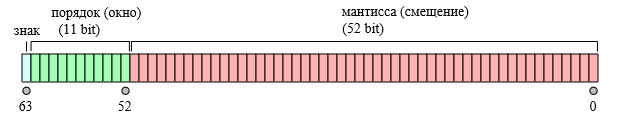
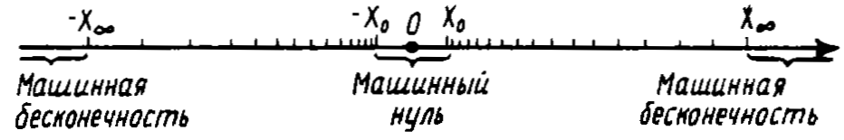

# Особенности компьютерной арифметики

## Что не так?

Значения функции на компьютере отличаются от принятых в математике:

$\cos\pi/2=0$, a `cos(pi/2) = 6.1232е-17`.

Результат суммирования зависит от порядка выполнения операций:
```
>> x = 0.1+(0.2+0.3);
>> y = (0.1+0.2)+0.3;
>> % x и y равны?
>> x==y

ans =
     0
```

**Математический объект $\ne$ Компьютерная реализация**


##

Источник проблем лежит в несовпадении машинной арифметики с обычной из-за конечности разрядной сетки компьютера.

Вещественные числа представляется в памяти компьютера в форме записи с *плавающей точкой*. 

Для хранения вещественного числа в памяти компьютера отводится поле стандартной длины — машинное слово длиной 64 бита. 


Запись числа с плавающей точкой похожа на экспоненциальную запись в математике:
$$
1045.86 \Rightarrow 0.104586 \cdot 10^4 \Rightarrow 104586E04
$$

##


Порядок (окно) сообщает нам, между какими двумя последовательными степенями двойки будет число: $[0,1]$, $[1,2]$, $[2,4]$, $[4,8]$, ..., $[2^{2047},2^{2048}]$.

Мантисса или смещение разделяет окно на $2^{53} = 9007199254740992$ сегментов. 

С помощью окна и смещения можно аппроксимировать число. 


## Пример аппроксимации числа


## Расстояние между соседними числами

В окне $[0,1]$ $9007199254740992$ смещений накладываются на интервал размером 1, что дает нам точность 
$$
\frac{(1-0)}{9007199254740992} = 1.1102230246251565404236316680908e^{-16} .
$$

В окне $[2^{12},2^{13}]$ смещения накладываются на интервал размером $8192-4096 = 4096$, что дает нам точность 
$$
\frac{(8192-4096)}{9007199254740992} = 4,5474735088646411895751953125e^{-13} .
$$


В окне $[2^{127},2^{128}]$ смещения накладываются на интервал $2^{128} - 2^{127} \approx 1,7014e^{+38}$, что дает точность
$$
\frac{(2^{128} - 2^{127})}{9007199254740992} = 18889465931478580854784 .
$$

## Следствие 1. В компьютере представимо конечное подмножество рациональных чисел

В компьютере представимы не все числа, а лишь конечное подмножество рациональных чисел, "укладывающихся" в рамки машинного слова. Любое другое число будет представлено с ошибкой округления, не меньшей единицы самого младшего разряда мантиссы.

**Машинным эпсилоном** (машинной точностью, `eps`) называется наименьшее представимое в компьютере число $\varepsilon$, удовлетворяющее условию $1 + \varepsilon > 1$.

Машинный эпсилон характеризует наименьшую относительную погрешность вычислений и зависит от архитектуры компьютера и разрядности вычислений (single, double,...).
```
eps = 1; x = 1;
while x + eps > x, eps = eps/2, end
```


## Следствие 2. Диапазон изменения чисел в компьютере ограничен

Существует минимальное $X_0$ (`realmin`) и максимальное $X_\infty$ (`realmax`) числа, которые можно представить на данном компьютере.
```
>> realmin
ans =
    2.225073858507201e-308
>> realmax
ans =
    1.797693134862316e+308
```

* Числа, меньшие по модуля $X_0$ для машины не различимы и представляют собой **машинный нуль** ($X_0 \ll \varepsilon$). 
* Числа, большие $X_\infty$ рассматриваются как машинная **бесконечность** (`Inf`).
* Диапазон представления чисел на компьютере определяется разрядностью порядка.


## Следствие 3. Числа на "компьютерной" числовой прямой распределены неравномерно.




## Вывод

\Large

Почти наверняка в представимом на компьютере множестве числе нет числа `у`, являющегося решением поставленной задачи. 

Лучшее, что можно попытаться сделать, — это найти его представление `у* = fl(у)` с относительной точностью порядка $\varepsilon$. 


# Символьные расчеты

##

Сравним следующие варианты кода:
```
a = sqrt(2)      % тип double, 8 байт
a = 1.4142
a = sqrt(sym(2)) % sym object, 138 байт (не бит!)
a = 2^(1/2)
```

Здесь `2^(1/2)` -- символьная запись числа, которое нельзя представить ни в виде обычной дроби, ни (за конечное время) в виде дроби десятичной.

Переменная `a` --  символьный объект.

Мы можем представлять числа в символьном виде, вводить символьные объекты и осуществлять операции над ними. Все это -- **символьные вычисления**.

С помощью символьных вычислений мы можем раскрыть скобки и преобразовать формулу, найти решение уравнения, найти предел функции, ее производную, вычислять интегралы, разложить функцию в ряд Тейлора или Фурье и мн. др.


## Создание символьных объектов

*Чтобы работать с «буквенными» выражениями, нужно определить все входящие в них «буквы» как символьные переменные.*

* `syms x y z …` — создание символьных объектов. Запятые между переменными не ставят!

По умолчанию символьные переменные принимают комплексные значения. Но это можно изменить, делая различные предположения:

*	syms a1 a2 … real — переменные определены в области действительных чисел.
*	syms a1 a2 … positive — переменные действительные и положительные.

Тип переменной виден в `Workspace`.


## Решение уравнений и систем

Уравнения представляют в виде
$$
f(x) = 0 .
$$
Системы
$$
\left\{
\begin{array}{l}
f_1(x_1, x_2, \ldots, x_n) = 0, \\
f_2(x_1, x_2, \ldots, x_n) = 0, \\
\ldots \\
f_n(x_1, x_2, \ldots, x_n) = 0. \\
\end{array}
\right.
$$

Запись в MATLAB
```
x = solve(f,x)
[x1,x2,…xn] = solve(f1,f2,…,fn,x1,x2,…xn)
```

`fi` — функции; `xi` — неизвестные.


## Примеры

```
syms x
f = 3*x^2-2*x+1; % Если f(x)=0, то правая часть не нужна
solve(f)
```
Даст 2 корня:
```
 (2^(1/2)*i)/3 + 1/3
 1/3 - (2^(1/2)*i)/3
```
Найдем формулу для корней квадратного уравнения
```
syms a b c x
f = a*x^2+b*x+c;
root = solve(f,x)
```
```
root =
 1/2/a*(-b+(b^2-4*a*c)^(1/2))
 -1/2*(b+(b^2-4*a*c)^(1/2))/a
```


## Пример. Решение системы уравнений, зависящих от параметров
$$
\left\{
\begin{array}{l}
ax_1 +x_1 x_2 +1 = 0, \\
x_1^2 +bx_2 = 0,
\end{array}
\right.
$$

``` 
syms a b x1 x2
f1 = a*x1+x1*x2+1;
f2 = x1^2+b*x2;
[x1,x2] = solve(f1,f2,x1,x2)
```
Другой вариант записи
```
[x1,x2] = solve('a*x1+x1*x2+1','x1^2+b*x2','x1','x2')
```
Если аналитическое решение найти невозможно, возвращается численное значение корней.


## Задача 1. Найти действительные корни уравнения

\label{t01}

$$
x^5-x-2=0 .
$$
с помощью функции `solve`.

Построить график кривой, заданной уравнением. На графике построить сетку и отметить корень уравнения точкой с маркером-кружком красного цвета.


## Задача 2. Решить систему линейных уравнений

\label{t02}

$$
\begin{array}{lll}
9x_1 - 10x_2 - x_3 &=& 4, \\
3x_1 - 7x_2 + 8x_3 &=& -3, \\
7x_1 + 6x_2 + 5x_3 &=& -7 \\
\end{array}
$$
1. при помощи `solve()`;
2. используя матричную запись системы $Ax=b$.

Сравните полученные решения, преобразовав символьные значения в вещественные числа (функцией `eval`) и вычислив модуль разности между решениями. Что можно сказать о различии между решениями?


# Математический анализ

## Предел

limit(f,x,x0) —  вычисление пределов $\lim_{x \rightarrow x_0} f(x)$.

`f` – символьная запись функции $f(x)$, `x` — символьная переменная, `x0` – предельное значение `x`.

Значение 1-го замечательного предела
$$
\lim_{z \rightarrow 0} \frac{\sin z}{z} = 1
$$
```
syms z
f = sin(z)/z;
limit(f,z,0)

ans =
 
1
```


## Задача 3. Вычислить предел

\label{t03}

$$
\lim_{x\rightarrow 4}\frac{x^2-6x+8}{x^2-5x+4}
$$


## Производная

`diff(f,x,n)` — вычисление производной функции $f(x)$.

`n` – порядок производной. По умолчанию `n=1`.

```
syms x
f = x*cos(x);
diff(f,x)

ans = 

cos(x) - x*sin(x)
```


## Задача 4. Вычислить первую и вторую производные функции

\label{t04}

$$
y = \sqrt{10-x^2} .
$$


## Интегралы

* `int(f,x)` — неопределенный интеграл вида $\int f(x) dx$. 
* `int(f,x,a,b)` — определенный интеграл $\int_a^b f(x) dx$; $a$, $b$ – границы области интегрирования $[a,b]$.

Вычислим интеграл $\int_0^\pi \sin x dx$

```
>> syms x
>> int(sin(x),x,0,pi)
 
ans =
 
2
```


## sym() превращает строку в символьный объект

```
>> int(sym('sin(x)'),sym('x'),0,pi)
 
ans =
 
2
```


## Несобственные интегралы

`int()` позволяет вычислять несобственные интегралы вида $\int_a^{+\infty} f(x) dx$, $\int_{-\infty}^b f(x) dx$ и $\int_{-\infty}^{+\infty} f(x) dx$. Для этого соответствующий предел интегрирования нужно указать равным `+inf/-inf`.

Вычислим 
$$
\int_{-\infty}^{+\infty} e^{-ax^2} dx .
$$

Результатом выполнения
```
syms a x
f = exp(-a*x^2); % точка не обязательна!
int(f,x,-inf,inf)
```
будет сообщение о невозможности найти интеграл. Между тем, он равен `sqrt(pi/a)`.


##

Интеграл можно найти только в предположении, что $a>0$. Тогда подынтегральная функция будет представлять собой гауссову кривую. 

Уточняем область определения `a`.
```
syms a positive
syms x
int(exp(-a*x^2),x,-inf,inf)


ans =
 
pi^(1/2)/a^(1/2)
```


## Кратные интегралы

Двойные интегралы вычисляются повторным применением `int()`. Найдем интеграл
$$
\int_c^d\int_a^b y\sin x dx dy
$$
```
syms a b c d x y
Ix = int(y*sin(x),x,a,b);
Iy = int(Ix,y,c,d);
pretty(Iy)

      2    2 
    (c  - d ) (cos(a) - cos(b)) 
  - --------------------------- 
                 2
```


## Задача 5. Вычислить интегралы

\label{t05}

$$
\int \cos 3x dx ,
$$
$$
\int_{-a}^a x^2 dx .
$$


## Разложение функции $f(x)$ в ряд Тейлора

```
taylor(f,x,x0)
```
`f` – функция; `x` – переменная дифференцирования; `x0` – точка, в окрестности которой выполняется разложение. По умолчанию возвращает 5 первіх членов ряда.

Разложим в ряд Тейлора функцию $y = \sin x$ в окрестности точки $x=0$
```
syms x
f = sin(x);
df = taylor(f,x)
 
df =
 
  x^5/120 - x^3/6 + x
```


## Задача 6. Разложить функцию в ряд Тейлора

\label{t06}

$$
y = \sqrt{10-x^2}
$$

в окрестности точки $x=0$ с точностью до членов 5-го порядка.

Постройте графики исходной функции и ее разложения в ряд Тейлора на интервале $x\in[-1;1]$. На графике построить сетку. Для преобразования символьного выражения в вещественные числа использовать `eval()`.


## Суммирование рядов $\sum_{k=1}^\infty f(k)$

```
symsum(f,k,a,b)
```
`k` – индекс суммирования; `a`,`b` – начальное и конечное значения индекса соответственно. 

Вычислим $s = \sum_{k=1}^\infty \frac{(-1)^k}{k^2}$:
```
syms k
f = (-1)^k/k^2;
s = symsum(f,k,1,inf)

s = 

  -1/12*pi^2
```
`symsum` удобно использовать для вычисления сумм, вместо использования циклов.


## Задача 7. Вычислить сумму ряда

\label{t07}

$$
\sum_{n=1}^\infty \frac{6}{9n^2+12n-5} .
$$

Построить график частичных сумм ряда для $n \in [1,100]$. Для этого удобно воспользоваться функцией `cumsum`.


## Арифметика заданной точности

`vpa(x,n)` вычисляет значение `x` с заданным числом цифр после запятой (`n`).

Вычислим pi с 320 знаками после запятой:
```
my_pi = vpa(pi,320) % my_py - 1x1 sym
 
my_pi =
 
3.14159265358979323846264338327950288419716939937510582
0974944592307816406286208998628034825342117067982148086
5132823066470938446095505822317253594081284811174502841
0270193852110555964462294895493038196442881097566593344
6128475648233786783165271201909145648566923460348610454
3266482133936072602491412737245870066063155882
```


# Преобразование/упрощение выражений

## "Вкалывают роботы, счастлив человек"

Точнее: достаточно задать начальные формулы, чтобы система символьных вычислений (система компьютерной математики, computer algebra system) произвела все расчеты и представила результаты в требуемом виде. 

**Но!** Не всегда готовые формулы получаются такими короткими и изящными, как бы нам того хотелось. Все преимущества формулы теряются из-за ее громоздкости. 

Появляется задача: как упростить получено выражение. 


## Отчего появляются длинные формулы?

Отчасти, это связано с тем, что MATLAB не «знает», что для нас важно, а что нет -- и это нужно ему «объяснить». 

Мы можем получать формулы, даже не зная стоящей за ними математической теории. Но чтобы воспользоваться результатами, нужно вспомнить все предположения, которые делаются при расчетах. 

Даже в этом случае результат все равно может получиться громоздким. ТОгда можно попробовать упростить его.


## Функции преобразования/упрощения выражений

Функциям преобразований и упрощения выражений в системах для символьных расчетов уделяется большое внимание. В MATLABе существует около дюжины таких функций, в частности:

* `simplify`
* `collect`
* `factor`
* `simple`
* `subs`


## Упрощение символьных выражений: simplify(f)

```
>> f = sin(x)^2+cos(x)^2;
>> simplify(f)

ans =
 
1
```

simplify способен упрощать выражения, содержащие алгебраические и тригонометрические функции, логарифмы и экспоненты, а также некоторые спецфункции.


## `collect` и `factor`

`collect(f,x)` — разложение полинома по степеням независимой переменной.

`x` – переменная, при степенях которой следует находить коэффициенты.
```
>> f = (x-1)*(x-2)*(x-3);
>> collect(f)

ans = x^3-6*x^2+11*x-6
```

`factor(f,x)` представляет полином `f` в виде произведения полиномов низших степеней с рациональными коэффициентами. То есть выполняет операцию, обратную `collect`:
```
>> f = x^3-6*x^2+11*x-6;
>> factor(f)

ans = (x-1)*(x-2)*(x-3)
```


## Упрощение методом грубой силы: `simple()`

`simple(f)` — упрощает символьные выражения, применяя для этого `simplify`, `collect`, `factor` и другие подобные функции, f затем возвращает самый короткий результат. Работает медленнее всех остальных функций упрощения.


## Подстановка одного выражения в другое: subs

```
subs(f,old,new)
```
`f` – выражение, в котором мы собираемся произвести замену; `old` – фрагмент, подлежащий замене; `new` – символьное выражение, которым нужно заменить `old`.
```
f = sym('a^2+b^2');
f1 = subs(f,'a','cos(x)');
f2 = subs(f1,'b','sin(x)');
f2
simplify(f2)
 
f2 = 
      cos(x)^2 + sin(x)^2
ans = 
      1
```


## Куда идти дальше?

Символьные расчеты в MATLAB выполняются с помощью Symbolic Math Toolbox. Чтобы воспользоваться символьными расчетами нужно, чтобы Symbolic Math Toolbox был установлен на вашей машине.

**Toolbox** (набор инструментов) в MATLABе — набор функций, направленных на решение определенной группы задач. 

Для более продвинутых символьных расчетов понадобится самостоятельные системы символьной математики.

Проприетарные:

* [Maple](https://www.maplesoft.com/products/maple/)
* [Mathematica](http://www.wolfram.com/mathematica/online/)

Свободные:

* [Maxima](http://maxima.sourceforge.net). GUI: wxMaxima, поддерживается Jupyter.


## Ссылки

1. *Амосов А.А, Дубянский Ю.А., Копченова Н.В.* Вычислительные методы для инженеров. — М.: Высшая школа, 1994. -- п. 2.5 "Особенности машинной арифметики", иллюстрация неравномерного распределения чисел на машинной прямой.
2. [Хабр. Наглядное объяснение чисел с плавающей запятой](https://habr.com/ru/post/337260/) -- иллюстрации, дополняющие объяснение чисел с плавающей запятой из книги Амосова и др.
3. [Floating point addition is not associative](http://www.walkingrandomly.com/?p=5380) -- простой пример не-ассоциативности сложения чисел на компьютере.
4. [Double-precision_floating-point_format](https://en.wikipedia.org/wiki/Double-precision_floating-point_format#/media/File:IEEE_754_Double_Floating_Point_Format.svg) -- исходная иллюстрация 64-битного представления чисел.


## Список задач

\Large

* \hyperlink{t01}{Задача 1}
* \hyperlink{t02}{Задача 2}
* \hyperlink{t03}{Задача 3}
* \hyperlink{t04}{Задача 4}
* \hyperlink{t05}{Задача 5}
* \hyperlink{t06}{Задача 6}
