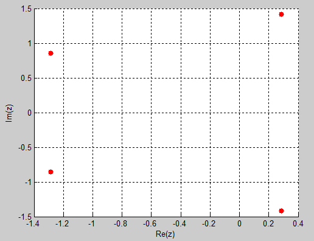
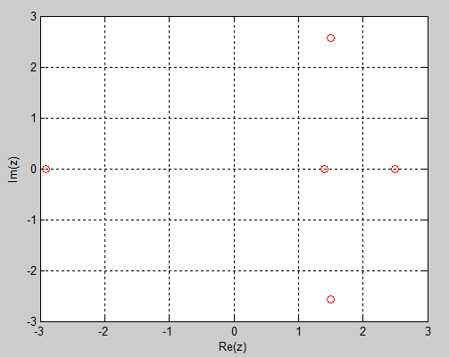
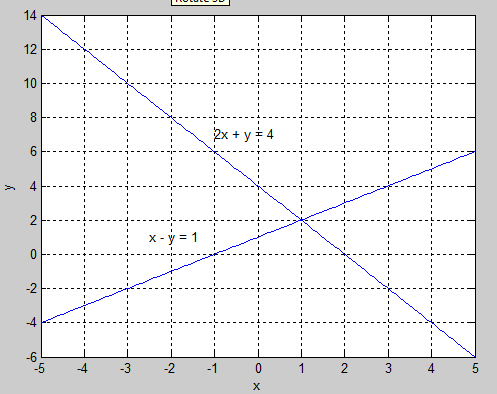
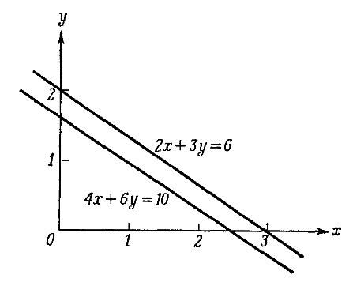
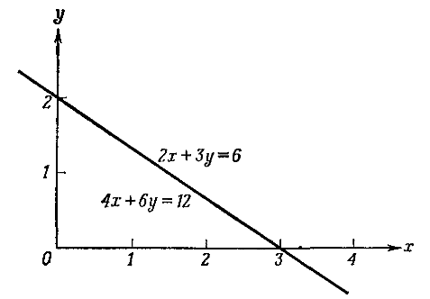
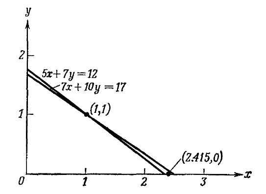

# Нелинейные уравнения

## Поиск корней полинома: roots

\small

Полином $n$-й степени имеет вид: 
$$
p_n(x) = c_1 x^n + c_2 x^{n-1}+ ... + c_n x + c_{n+1} .
$$
Корни полинома -- корни уравнения
$$
p_n(x) = 0 .
$$

В MATLAB полином $n$-й степени запишется как
```
с(1)*x^n + с(2)*x^(n-1)+... + c(n)*x + c(n+1)
```
Вектор коэффициентов полинома `C` равен
```
C = [c(1) c(2) … c(n) c(n+1)]
```
`roots(C)` — вычисляет корни полинома (действительные и комплексные), коэффициенты которого заданы вектором `C`.

Число элементов вектора `C` всегда на единицу больше степени полинома. Нулевые коэффициенты должны содержаться в векторе.


## Пример. Найти корни полинома $2x^2+3x+1=0$. 

Запишем вектор коэффициентов и применим к нему функцию `roots`.

```
>> P = [2 3 1];
>> roots(P)
   -1.0000
   -0.5000
```


## Комплексные корни

Уравнение: $x^4+2x^3+3x^2+4x+5=0$.

```
p = [1 2 3 4 5];
r = roots(p)
scatter(real(r),imag(r),'filled','red'), grid on
xlabel('Re(z)'),ylabel('Im(z)')
```
Результат:
```
r =

   0.2878 + 1.4161i
   0.2878 - 1.4161i
  -1.2878 + 0.8579i
  -1.2878 - 0.8579i
```


##




## Задача 1. Найти корни уравнения

\label{t01}

$$
x^4 - 7x^3 + 3x^2 - 5x + 9 = 0 .
$$

Отобразить найденные корни на комплексной плоскости.


## Пример. Найти корни функции

$$
f(x) = x^3 - \frac{10}{(2-x)^2} + 25 .
$$

```
syms x
% Исходная функция
f = x^3 - 10/(2-x)^2 + 25;
% Приводим к общему знаменателю
ff = factor(f)
% Извлекаем числитель
[f_nm,~] = numden(ff)
```
```
ff =
  (x^5 - 4*x^4 + 4*x^3 + 25*x^2 - 100*x + 90)/(x - 2)^2
 
f_nm =
  x^5 - 4*x^4 + 4*x^3 + 25*x^2 - 100*x + 90
```

##

```
% Собираем коэффициенты в порядке убывания
[my_coeffs,~] = coeffs(f_nm,x)
% Найдем корни полинома
r = roots(my_coeffs)

my_coeffs =
  [ 1, -4, 4, 25, -100, 90]
```

\scriptsize

```
r =
  
                                     -2.9077407016914873169506191942647
                                      1.3996100646468305812335683631853
                                      2.4965355242358652368432085736757
1.5057975564043957494369211287019 - 2.5672365012647893529547353691146*i
1.5057975564043957494369211287019 + 2.5672365012647893529547353691146*i
```

\normalsize

```
plot(real(r),imag(r),'ro'), grid on
xlabel('Re(z)'),ylabel('Im(z)')
```


##




## Поиск действительных корней произвольной функции одной переменной: fzero

```
x = fzero(@fun, x0)
```
* `fun` – имя функции
* `x0` – начальное приближение (число или вектор)
* `x` – корень уравнения

Если `x0` — число, то `fzero` пытается отыскать интервал в окрестности начального приближения `x0`, на котором функция `fun` меняет знак. 

Для поиска начального приближения удобно использовать графические функции: `plot`, `fplot`. 

Задать интервал поиска можно с помощью вектора `x0`. Тогда `fzero` будет искать значение корня на интервале `[x0(1), x0(2)]`. Если корней на этом интервале нет или функция терпит разрыв в окрестности начального приближения, то возвращается значение `NaN` (Not a Number).


## Пример. Найти корни функции $x^3-1.1x^2-2.2x+1.8$

```
% Функция: 
f = @(x) x^3-1.1*x^2-2.2*x+1.8;
% задаем начальное приближение
x = fzero(f,-1.5)
% или интервал поиска
x = fzero(f,[1.5 2])

x1 =
   -1.3970

x2 =
    1.7685
```


## Еще один вариант использования функции fzero

Создадим в отдельном файле `poly4.m` m-функцию
```
%%%%%%% poly4.m %%%%%%%%%%%%
function y = poly4(x)
y = x.^3-1.1*x.^2-2.2*x+1.8;
```

и запустим fzero, передав в нее созданную функцию
```
fzero(@poly4,0.5)

x3 =

    0.7286
```


## Все и сразу

```
fzero(f,[-1.5 1.5])

% Error using fzero
% The function values at the interval endpoints 
% must differ in sign.
```

А вот `roots()` может все и сразу:
```
r = roots([1 -1.1 -2.2 1.8])

% r =
% 
%    -1.3970
%     1.7685
%     0.7286
```


## Задача 2

\label{t02}

Найти корни функции
$$
f(x) = x^3 - 5x^2 - x + 2
$$
с помощью:

1. `roots()`
2. `fzero()`


## Зачем нужно несколько функций поиска корней?

`solve()` ищет аналитические и численные решения уравнений, работает с более широким классом функций, чем `roots` и единственная среди подобных функций работает с системами уравнений. Зачем тогда нужны остальные функции?

Но:

* `fzero` работает с любыми действительными функциями одной переменной, а `solve` только с теми, которые можно задать формулой. Это не всегда возможно: функция может быть задана, например, виде m-функции.
* если нужно численное значение корней полиномов, то `roots` работает быстрее `solve`.

**Еще:** `fsolve` (Optimization Toolbox)


## Пример. Найти корни уравнения $\cos 5x = x$ на промежутке $-2\pi \le x \le 2\pi$

```
f = @(x) cos(5*x) - x;
z = fzero(f, [-2*pi,2*pi])


 z =
 
     0.2613
```


# Системы линейных уравнений 

## 

Системы линейных уравнений встречаются почти в каждой области прикладной математики. 

Рассмотрим систему из $n$ уравнений с $n$ неизвестными ($n$-го порядка). Каждый член такого уравнения содержит только одно неизвестное, и каждое неизвестное входит в него в первой степени. Такая система уравнений называется **линейной**

$$
\begin{array}{lll}
a_{11} x_1 + a_{12} x_2 + \ldots + a_{1n} x_n &=& b_1, \\
a_{21} x_1 + a_{22} x_2 + \ldots + a_{2n} x_n &=& b_2, \\
\ldots \\
a_{n1} x_1 + a_{n2} x_2 + \ldots + a_{nn} x_n &=& b_n . \\
\end{array}
$$

В матричной записи система линейных уравнений имеет вид
$$
Ax = b .
$$

 
## Геометрическая трактовка решения

Рассмотрим систему линейных уравнений 2-го порядка. На общность рассуждений это не повлияет.
$$
\begin{array}{lll}
a_{11} x_1 + a_{12} x_2 &=& b_1, \\
a_{21} x_1 + a_{22} x_2 &=& b_2. 
\end{array}
$$
Или, в матричной записи
$$
Ax = b .
$$
$$
A = \left[
\begin{array}{ll}
a_{11} & a_{12} \\
a_{21} & a_{22} 
\end{array}
\right] ,
\quad
x = \left[
\begin{array}{l}
x_{1} \\
x_{2} 
\end{array}
\right] ,
\quad
b = \left[
\begin{array}{l}
b_{1} \\
b_{2} 
\end{array}
\right] .
$$
В случае двух неизвестных каждое уравнение графически изображается прямой линией на плоскости. 

Искомое решение должно удовлетворять одновременно всем уравнениям. На плоскости это — точка пересечения графиков прямых.


## Пример

$$
\begin{array}{lll}
2 x + y &=& 4, \\
x - y &=& -1. 
\end{array}
$$
```
x = linspace(-5,5,100);

y = x+1;
plot(x,y), grid on, hold on
xlabel('x'), ylabel('y')
text(-2.5,1,'x - y = 1')

y1 = -2*x+4;
plot(x,y1)
text(-1,7,'2x + y = 4')
```


##




## Задача 3

\label{t03}

Найти решение системы уравнений
$$
\begin{array}{lll}
x + 3y - 2z &=& 5, \\
3x + 5y + 6z &=& 7, \\
2x + 4y + 3z &=& 8 .
\end{array}
$$


## Сколько решений у линейной системы?

Имеет ли данная система какое-либо решение и, в случае если это решение существует, является ли оно единственным? На этот вопрос существуют три варианта ответа.

1. Решение системы уравнений существует и является единственным.
2. Система уравнений не имеет решения.
3. Система уравнений имеет бесконечное множество решений.


## 1. Решение существует и является единственным

$$
\begin{array}{lll}
2 x + y &=& 4, \\
x - y &=& -1. 
\end{array}
$$
```
A = [2 1; 
    1 -1];
b = [4; 
    -1];
x = A\b

  x =
       1
       2

det(A) % определитель A

  ans =
       -3
```


## 2. Система уравнений не имеет решения
$$
\begin{array}{lll}
2 x + 3 y &=& 6, \\
4x + 6 y &=& 10. 
\end{array}
$$




##

```
A = [2 3; 4 6];
b = [6; 10];
eps = 1e-4;
if abs(det(A))<eps, error('det(A)=0'), end
x = A\b
```
```
>> det(A)

ans =

     0
```


## 3. Система имеет бесконечное множество решений
$$
\begin{array}{lll}
2 x + 3 y &=& 6, \\
4x + 6 y &=& 12. 
\end{array}
$$




##

```
A = [2 3; 4 6];
b = [6; 12];
x = A\b


Warning: Matrix is singular to working precision. 

x =

   NaN
   NaN
```


## Плохо обусловленные системы

\small

Системы линейных уравнений вида 2 и 3 являются вырожденными случаями. На практике гораздо чаще встречаются почти вырожденные системы, при решении которых можно получить недостоверные значения неизвестных. Рассмотрим систему:



 
## Пример плохо обусловленной системы

```
A = [5 7; 7 10];
b = [12; 17];
det(A)
x = A\b
% или так:
x = A^-1*b
x = inv(A)*b
x = mldivide(A,b)
```


##

У плохо обусловленной системы $det A \approx 0$.

В этом случае найти численное решение системы трудно, а точность его весьма сомнительна.

Хотя ошибка в решении проявляется из-за погрешностей данных (коэффициентов системы), сама система "предрасположена" чутко реагировать на наличие таких погрешностей. 

Возможно, следует:

1. переформулировать задачу так, чтобы избежать плохо обусловленной системы или
2. использовать для решения плохо обусловленных систем специальные методы.


## Задача 4

\label{t04}

Решить систему уравнений
$$
\begin{array}{lll}
x_1 - x_2 + x_3 &=& 0, \\
10x_2 + 25x_3 &=& 90, \\
20x_1 + 10x_2 &=& 80
\end{array}
$$
и проверить правильность полученного решения.


## Список задач

\Large

* \hyperlink{t01}{Задача 1}
* \hyperlink{t02}{Задача 2}
* \hyperlink{t03}{Задача 3}
* \hyperlink{t04}{Задача 4}
