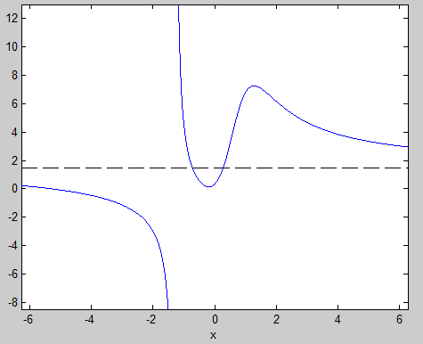
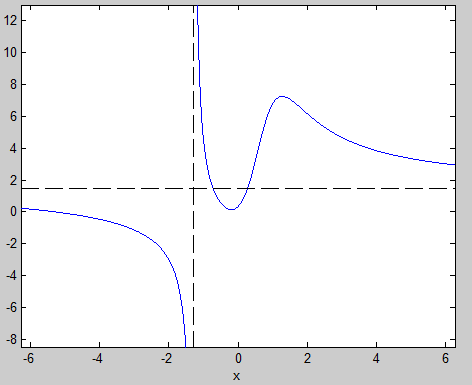
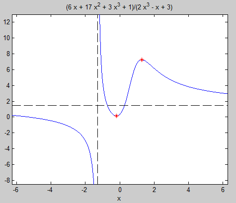
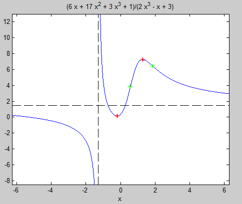
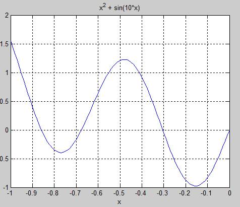
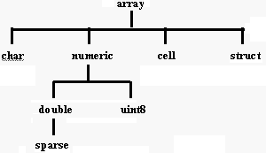
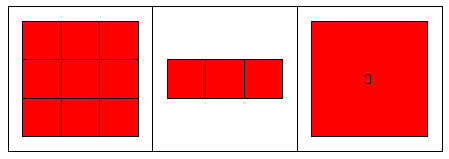

# Поиск максимумов, минимумов и точек перегиба

## Первая производная

Вычисление первой производной функции $f(x)$ дает возможность найти локальные максимумы и минимумы.

Найдем первую производную следующей функции
$$
f (x) = \frac{3 x^3 + 17 x^2 + 6 x + 1}{2 x^3 - x + 3}
$$

Запишем символьное выражение
```
syms x
f = (3 * x^3 + 17 * x^2 + 6 * x + 1)/(2 * x^3 - x + 3)
```

Построим график этой функции
```
ezplot(f) % В новых версиях: fplot(f)
```


## Асимптоты

![График функции имеет горизонтальную и вертикальную асимптоты. Локальный минимум находится на промежутке [-1,0], локальный максимум -- в [1,2]](images/fplot.png)


##

По умолчанию символьные величины создаются комплексными, но нам достаточно вещественных значений. Предположим (assume), что `x` является вещественным (`real`):
```
assume(x, 'real')
```
Чтобы найти горизонтальную асимптоту, вычислим предел функции `f` при `x` стремящемся к $+\infty$ и к $-\infty$:
```
hasy = [limit(f, x, sym(inf)), limit(f, x, -sym(inf))]

  hasy =
 
    [ 3/2, 3/2]
```
Добавим асимптоту к графику
```
hold on
line([-10, 10], hasy, 'Color', 'k', 'LineStyle', '--');
```


##




##

Чтобы построить вертикальную асимптоту `f`, найдем корни полинома, являющегося знаменателем `f`:
```
vasy = solve(2 * x^3 + x * -1 + 3 == sym(0), x)

vasy =
 
  - 1/(6*(3/4 - (241^(1/2)*432^(1/2))/432)^(1/3)) - (3/4 -
  (241^(1/2)*432^(1/2))/432)^(1/3)
```
Найдем приближенное значение этого числа при помощи функции `vpa`
```
vpa(vasy,6)

ans =
 
-1.28962
```


##




## Поиск локальных экстремумов

Если точка является локальным экстремумом функции $f(x)$ (минимумом или максимумом), то первая производная $g = f'(x)$ в этой точке равна нулю:
```
g = diff(f, x)

g =
 
(9*x^2 + 34*x + 6)/(2*x^3 - x + 3) - 
((6*x^2 - 1)*(3*x^3 + 17*x^2 + 6*x + 1))/(2*x^3 - x + 3)^2
```


##

Решим уравнение $g(x) = 0$:
```
solve(g == 0, x);
extrema = vpa(ans, 6)

extrema =
 
   1.28598
 -0.189245
```

Теперь у нас есть координаты экстремумов. Тип экстремума (максимум или минимум) определим, пользуясь 2-ой производной $h = f''(x)$.

* $f''(x_0) > 0$, $x_0$ -- минимум;
* $f''(x_0) < 0$, $x_0$ -- максимум;
* $f''(x_0) = 0$, $x_0$ -- ?


##

```
h = simplify(diff(f, x, 2))    % h = simplify(diff(g, x))
subs(h, x, extrema)

ans =
 
 -9.148586299108628836484272395515
 9.7356976182397201186055335918601
```

Таким образом: 

* $x_1 = 1.28598$ -- максимум,
* $x_2 = -0.189245$ -- минимум.


##




## Точки перегиба

$f''(x_0) = 0$, $x_0$ -- точка перегиба.
```
inflection = vpa(solve(h == 0, x),6)


inflection =
 
  1.86515
 0.578718
```


##




## fminbnd(f,a,b) -- поиск экстремумов $f(x)$ на интервале $[a;b]$




##
```
f = @(x) x.^2 + sin(10*x);

x = -1:.01:0;
y = f(x);
plot(x,y), grid on

fminbnd(f,-1,-0.6)


ans = 

     -0.76994
```


##

```
[x ymin] = fminbnd(f,-0.6,-0.4)

  x = 
       -0.5999
       
  ymin = 
        0.6399

[x ymin] = fminbnd(f,-0.4,0)

  x = 
       -0.15400
       
  ymin = 
        -0.97581
```


## Больше методов оптимизации

\Large

* Optimization Toolbox (fminsearch)
* Global Optimization Toolbox
    * Прямые методы поиска
    * Генетические алгоритмы
    * Метод имитации отжига
    * Многоцелевая оптимизация


# Составные типы данных в MATLAB

## Таблица типов данных в MATLAB



## Структура 

представляет собой элемент данных, содержащий разнотипные поля.

```
S.name = 'Juan Петров';
S.date = '5-05-2010';
S.grade = 4;
```

создает структуру S с тремя полями: `name` (строка), `date` (строка), `grade` (число). Поля отделяются от имени структуры точкой.

Как и всё в MATLAB, структуры являются массивами. Каждый элемент такого массива структур является структурой с несколькими полями. 


## Поля структуры могут добавляться

* по одному

```
S(2).name = 'Маша Антипенко';
S(2).date = '6-05-2010';
S(2).grade = 5;
```
Индекс конкретной структуры в массиве указывается после имени массива.

* вместе, с помощью функции `struct`

```
S(3) = struct('name','Света Захарова','date', ...
              '7-05-2010','grade',4)
```


## Когда использовать

Обычные массивы удобны при работе с однородными данными — только числами или только строками. 

Массив структур удобно использовать, когда информация может быть представлена в виде таблицы.

Структуры используются функциями MATLAB

* для настройки параметров,
* для сообщения дополнительных подробностей о результате.

Например, структуры используются функциями, реализующими вычислительные методы. Кроме результата такие функции могут сообщать об используемом методе, о количестве сделанных приближений и т.п., т.е. информацию которую нельзя представить в виде только чисел или только строк.


## Массивы ячеек

Ячейку можно представить себе как контейнер для хранения любых данных, а массив ячеек — как набор таких контейнеров — «камеру хранения»:




## 

Элементами массива ячеек (cell array) могут быть любые типы данных, в том числе и другие массивы ячеек. 

Мы уже не раз использовали массивы ячеек: в виде массивов ячеек организовано хранение входных и выходных параметров функций.

Массив ячеек создается путем заключения группы объектов в фигурные скобки:
```
A = eye(3,3);
С = {A sum(A) prod(prod(А))}
```

дает массив ячеек C размерности 1x3. Эти три клетки содержат: 1) матрицу A, 2) вектор-строку с суммами столбцов этой матрицы и 3) произведение ее элементов:
```
С =
[3x3 double]    [1x3 double]    [0]
```


##

Для просмотра содержимого ячеек, помимо Array Editor, используются функции `celldisp` и `cellplot`.
 
`cell(m,n)` — создает массив ячеек размера m х n, элементами которого являются пустые матрицы. Эту функцию удобно использовать для предварительного выделения памяти под массив ячеек.

Для получения доступа к содержимому ячеек используются индексы элементов, заключенные в фигурные скобки. Например, `С{1}` возвращает матрицу `A`, а `С{3}` — число `0`.

Если нужно извлечь из хранящихся в ячейке данных отдельный элемент, например элемент первой строки и второго столбца — `(1,2)` — матрицы, хранящейся в ячейке `C{1}`, нужно набрать `C{1}(1,2)`.


## Важно!

\Large

Массивы ячеек содержат *копии* других массивов, а не ссылки на них. 

Поэтому, если вы впоследствии измените матрицу `А`, с массивом ячеек `С` ничего не произойдет.


## Резюме

для хранения разнотиповых и "разноразмерных" данных в одной переменной  используются: 

1. массивы структур: `structArray(structIndex).Field`
2. массивы ячеек: `cellArray{cellIndex}`

Выбор типа составных данных зависит от конкретной задачи. Спросите себя, что вы предпочтете: обращаться к элементам переменной по именам или по номерам. В первом случае вам понадобится массив структур, во втором — массив ячеек. 

Эти типы данных можно представлять себе как таблицы — с заголовками (структуры) и без заголовков (ячейки).

Переход между структурами и ячейками выполняется с помощью функций `cell2struct` и `struct2cell`.


## Ссылки

* [Maxima, Minima, and Inflection Points](https://se.mathworks.com/help/symbolic/examples/maxima-minima-and-inflection-points.html)
* [Extreme Values of Functions](http://faculty.cooper.edu/smyth/TechCompanion/Calc1/Ch04/ExtremeValues.htm)

