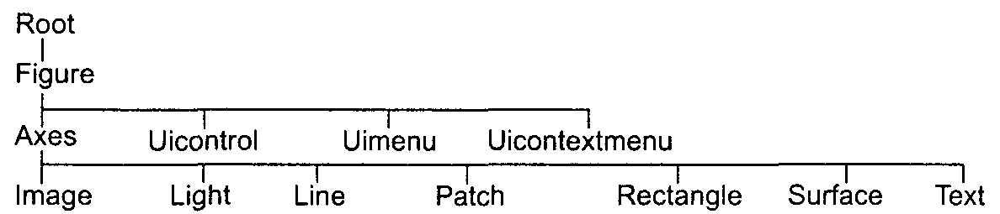
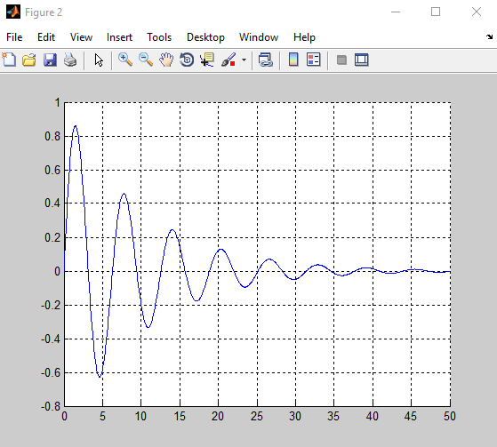
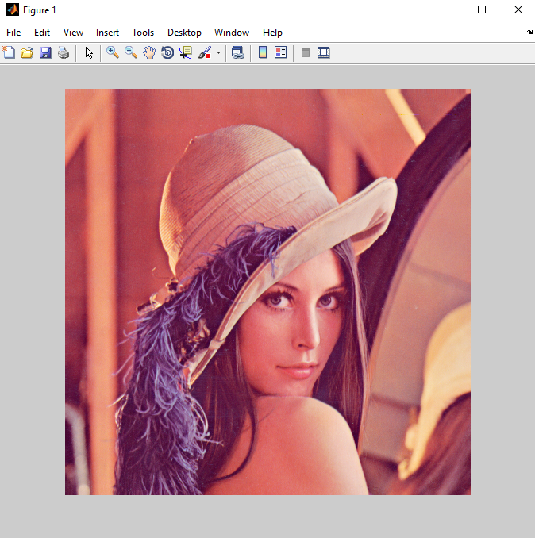
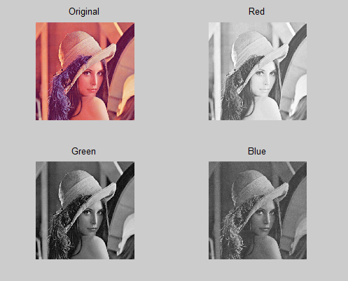
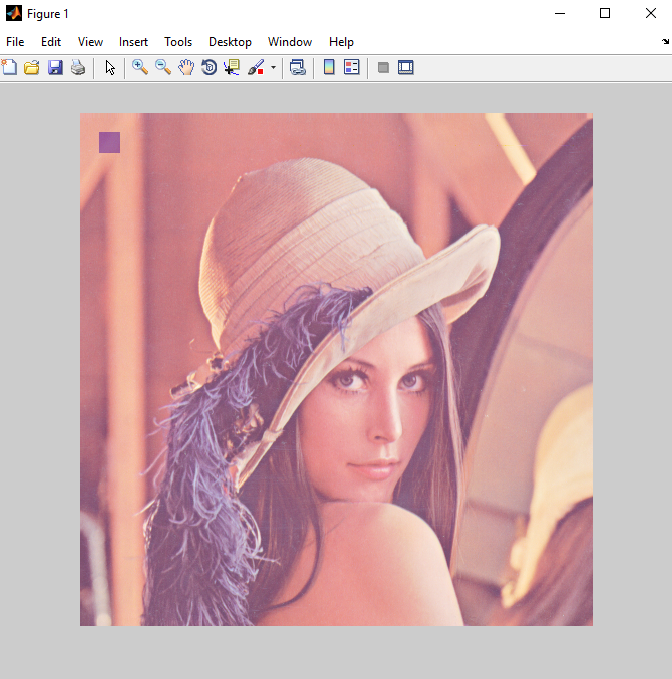
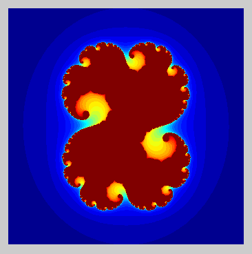
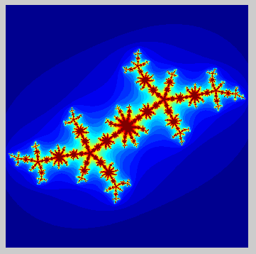
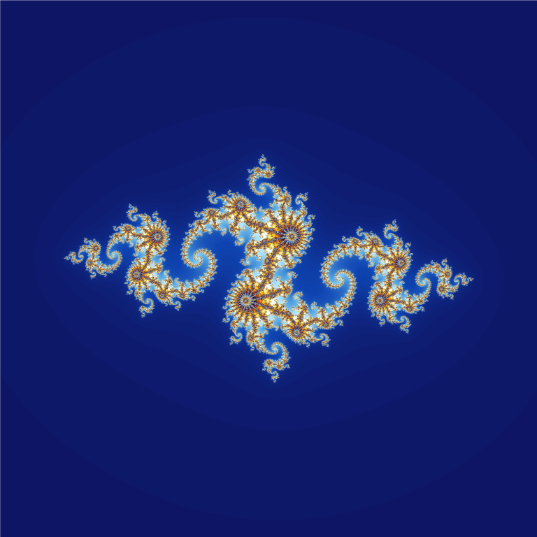
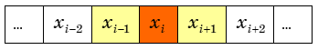
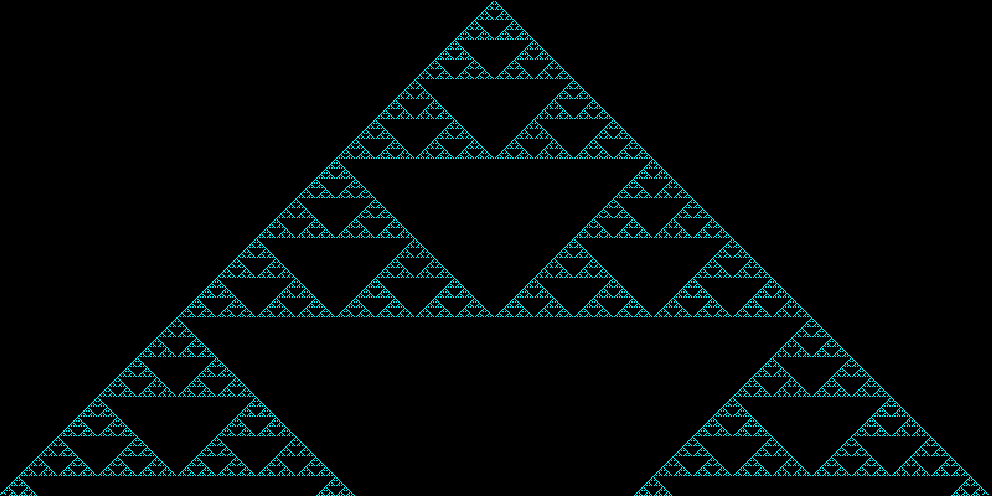

# Низкоуровневая (дескрипторная) графика

## Высокоуровневые графические функции

`plot`, `surf`, `mesh` делают сразу несколько дел: 

1. строят графическое окно;
2. определяют параметры координатных осей; 
3. строят координатные оси;
4. строят кривую или поверхность, то есть собственно график. 

Все это можно сделать по частям с помощью низкоуровневых графических функций.


## Иерархия графических классов



\scriptsize

1. `root` — соответствует экрану компьютера. В работе явно не используется.
2. `figure` (рисунок) — графическое окно.
3. В окне размещаются:
    * \scriptsize `axes` — координатные оси;
    * `UI*` — элементы пользовательского интерфейса (меню, кнопки и др.).
4. В осях координат располагаются
    * \scriptsize `line` — (линия) кривая графика функции одной переменной;
    * `text` — текстовая надпись;
    * `surface` — поверхность, являющаяся графиком функции двух переменных.


## Конструкторы объектов

`patch()` рисует многоугольник, закрашиваемый заданным цветом:
```
x = [0 1 2];
y = [0 1 0];
patch(x,y,'r')
```
Названия функций-конструкторов обычно совпадают с названиями создаваемых ими графических объектов.


## Указатели объектов

Как отличить один графический объект от другого?

Создадим объект `figure`:
```
h = figure;
```

`h` — указывает на этот объект. Во всех операциях с данным окном мы будем использовать этот указатель. Если это первое открытое графическое окно, то `h = 1`.

Создадим новое окно, не закрывая первого:
```
p = figure;
```

`p = 2`. Указатель объектов `figure` — целое число, номер графического окна.


##

Указатели или дескрипторы -- не совсем удачный перевод термина "handle" — титул, прозвище, кличка. 

Указатель — это то, с помощью чего MATLAB отличает один объект от другого. Можно воспринимать указатель как имя объекта или как ссылку на объект.

Другой способ указать на объект — понятие "текущего" или "активного" объекта. 


## Управление свойствами объектов: get(h)

Построим график из отрезков линии красного цвета:
```
h = line([0 2 5],[1 4 -1],'Color','r')

  h = 
      3.0017
```

Теперь объект `line` имеет указатель `h` и узнать свойства этого объекта можно так:
```
get(h)
```

##

\tiny

```
	DisplayName = 
	Annotation = [ (1 by 1) hg.Annotation array]
	Color = [1 0 0]
	LineStyle = -
	LineWidth = [0.5]
	Marker = none
	MarkerSize = [6]
	MarkerEdgeColor = auto
	MarkerFaceColor = none
	XData = [0 2 5]
	YData = [1 4 -1]
	ZData = []

	BeingDeleted = off
	ButtonDownFcn = 
	Children = []
	Clipping = on
	CreateFcn = 
	DeleteFcn = 
	BusyAction = queue
	HandleVisibility = on
	HitTest = on
	Interruptible = on
	Parent = [174.007]
	Selected = off
	SelectionHighlight = on
	Tag = 
	Type = line
	UIContextMenu = []
	UserData = []
	Visible = on
```


## Управление свойствами объектов: set(h)

Изменить свойств объекта позволяет функция `set`:
```
set(h, 'Color', [0 1 0]) % можно 'g', 'green'.
```

Цвет кривой на построенном нами графике (указатель `h`) сменится на зеленый.

Общий вид функции: `set(указатель, 'Свойство', значение)`

Низкоуровневые графические функции позволяют управлять тонкими свойствами графических объектов, которые нельзя изменить с помощью функций высокого уровня:
```
set(h, 'LineWidth', 1)
set(h, 'FontSize', 12)
```

Удаление объекта: `delete(h)`


## Пример. Динамический график

```
%% Статический график
n = 1000;
x = linspace(0,50,n); y = exp(-0.1*x).*sin(x);
plot(x,y)
% Возьмем пределы из готового графика.
limits = get(gca, {'xlim', 'ylim'});
celldisp(limits)

  limits{1} =
     0    50

  limits{2} =
 
   -0.8000    1.0000
```


##

```
%% Динамический график
figure; grid on;
set(gca,'XLim',limits{1},'YLim',limits{2});
h = line([x(1),x(2)],[y(1),y(2)],'EraseMode','none');
for i=2:n
    set(h,'XData',[x(i-1),x(i)],'YData',[y(i-1),y(i)]);
    drawnow;
    %pause(1e-6);
end
set(h,'XData',x,'YData',y)

% Закрыть все окна графиков
%close all
```


##




## Задача 1. Случайное блуждание на плоскости

\label{t01}

Получите на экране картину движения точек, моделирующих случайные блуждания на плоскости. На каждом шаге координаты частицы $x$ и $y$ случайным образом принимают значения +1, 0 или -1. Число шагов -- не менее 300. 

Выведите номер шага в заголовок графика. Для итоговой картинки сделайте скриншот и поместите его в отчет.


## Задача 2. Запись видео

\label{t02}

Запишите каждый кадр анимации (шаг случайного блуждания) из \hyperlink{t01}{задачи 1} в массив с помощью `getframe`.

Сохраните массив кадров в avi-файл функцией `movie2avi`.


# Изображения

## Чтение/запись изображения

```
A = imread(filename, fmt)
```
читает изображение из файла с `filename` и помещает его в массив A. 

Формат файла `fmt` при вызове функции может быть опущен, тогда формат определяется из содержимого файла.

**Вместо `filename` можно указать `URL`.**

Запись изображения в файл: `imwrite(A, filename, fmt)`


##

Любой цвет задается смесью красного (Red), зеленого (Green) и синего (Blue) цветов. 

Интенсивность пиксела цветного изображения характеризуется тремя числами: I(M,N,3). M, N – разрешение (количество пикселей) по Ox, Oy.

I(:,:,1) -- интенсивность красного цвета, I(:,:,2) — интенсивность зеленого и I(:,:,3) — синего.

Интенсивность -- положительное целое число: `uint*`.

```
A = imread('../images/lenna.png');
imshow(A);
imfinfo('../images/lenna.png')
```


##




##

`imshow(filename)`, `imshow(A)` — вывод изображения на экран.

**Внимание: `imshow` имеет очень много опций!**

`imfinfo(filename, fmt)`  — получение информации об изображении:

*	дата создания
*	размер
*	формат
*	метод кодирования 
*	глубина цветопередачи
* ...


## Информация о файле

```
Filename: 'D:\км_2019\09\images\lenna.png'
FileModDate: '08-Mar-2019 09:58:08'
FileSize: 473831
Format: 'png'
Width: 512
Height: 512
BitDepth: 24
ColorType: 'truecolor'
```


## inshow + subplot

```
A = imread('../images/lenna.png');
subplot(2,2,1); imshow(A); title('Original');
subplot(2,2,2); imshow(A(:,:,1)); title('Red');
subplot(2,2,3); imshow(A(:,:,2)); title('Green');
subplot(2,2,4); imshow(A(:,:,3)); title('Blue');
```


##




##  Рисунок поверх рисунка: используем прозрачность

```
A = imread('../images/lenna.png');
imshow(A); hold on
% Создаем квадрат вверху слева
B = ones(size(A));
B(20:40,20:40,[1,2]) = 0; % только синий цвет
upimg = imshow(B);
% Задаем прозрачность верхнего изображения
alpha(upimg,0.3)
```


##




# Фракталы и клеточные автоматы

## Фракталы

Фрактал — это объект (например, кривая), обладающий свойством самоподобия. Понятие ввел Бенуа Мандельброт.

Фракталы обнаружились при измерении рек и границ. 

Длина государственной границы между Испанией и Португалией в справочниках этих стран какое-то время отличалась на 20% (Испания насчитала 616 миль, а Португалия 758 миль). Оказалось, что страны измеряли протяженность границы разными "линейками". Короткая "линейка" позволяла учитывать мелкие детали, что в итоге и дало 20% разницы. 

Был некоторый скандал, а потом разобрались, что во всем виноваты фракталы. 
\tiny

*Источник:* http://paulscottinfo.ipage.com/fractals-in-nature/3/F2.spain-portugal-border.html


## Множество Жюлиа

Гастон Жюлиа, лежа в больнице после ранения, развлекался вычислением последовательности
$$
Z_{n+1} = Z_{n}^2 + C .
$$

Оказалось, что после нескольких итераций точки либо остаются в пределах ограниченной области, либо "убегают" на бесконечность. 


## Остающиеся точки




##

Было доказано, что как только выполняется $|Z_n| \ge 2$, то последовательность стремится к бесконечности. 

Проверка этого свойства позволяет выделять точки, не попадающие внутрь множества.

Напрашивается алгоритм:

1) задаем кол-во итераций;
2) задаем исследуемую область;
3) задаем начальную точку C;
4) выполняем заданное число итераций для каждой точки области;
5) рисуем точки, которые остались в области.


##

```
iter = 30;   % кол-во итераций
npix = 1000; % размер изображения: npix х npix
% Область наблюдения
dl = 1.5;
x = linspace(-dl,+dl,npix);
y = linspace(-dl,+dl,npix);
[X,Y] = meshgrid(x,y);
Z = X + i*Y;
% Начальная точка
C = 0.27334-0.00742i;

B = zeros(npix);

for l = 1:iter
    Z = Z.^2 + C;       
    B = B + (abs(Z)<2);
end;

imagesc(B);
```


## C = -0.561321 + 0.64100i




## Wikipedia: Julia Set




## Задача 3.

\label{t03}

Постройте множество Жюлиа, выбрав начальную точку самостоятельно. Отобразите выбранную начальную точку в заголовке графика и сделайте скриншот полученного множества.

Постройте множество Жюлиа, применив для итераций одну из следующих функций:

* `Z.^3 + C`
* `Z.^4 + C`
* `cosh(Z)`
* `cot(Z)`
* `sin(Z).*cos(Z)`
* `sinh(Z)`
* `tan(Z)`
* `Z.*cos(Z), Z.*sin(Z)`


## Одномерный клеточный автомат

Клеточный автомат (КА) -- набор конечного числа элементов (клеток), образующих регулярную сетку. 

Каждая клетка находится в одном из конечного числа состояний. Например, 0 или 1. 

Окрестность клетки состоит из нее самой и соседних клеток. В одномерном КА под окрестностью клетки понимается она сама и ее соседи слева и справа.




##

Состояние клетки изменяется по шагам, в зависимости от состояния ее окрестности. 

Пусть текущее состояние всех клеток известно (задано). На следующем шаге состояние каждой клетки преобразуется по определенным правилам. Например, таким

111 |	110	| 101	| 100	| 011	| 010	| 001	| 000 |
----|-----|-----|-----|-----|-----|-----|-----|
0	  |   1	|   0	|   1	|   1	|  0 	|  1	|  0  |

Первая строка -- текущее состояние окрестности, вторая -- состояние центральной клетки на следующем шаге.

Первое правило (крайнее слева): если все клетки окрестности активны (1), то на следующем шаге центральная клетка пассивна (0).


##



Казалось бы, подобные КА должны эволюционировать либо к простым пространственно-однородным состояниям, либо к периодическим структурам. Однако это не так.


## Задача 4. Одномерный КА

\label{t04}

Запрограммируйте для одномерного КА следующие правила 

111	| 110	| 101	| 100	| 011	| 010	| 001	| 000 |
----|-----|-----|-----|-----|-----|-----|-----|
 0	| 0	  | 0	  | 1	  | 1	  | 1	  | 1	  | 0   |

Образец кода: `source/onedimca.m`

Проследите за эволюцией данного КА. В конце сделайте скриншот и поместите его в отчет.


# Бонус

## Игра "Жизнь". Джон Конуэй, 1970 г.

Клетки игрового поля размечаются в начале игры как живые (1) или мертвые/пустые (0).

### Правила

1. Если у пустой клетки есть ровно 3 живых соседа, то на следующем ходу в ней происходит «рождение».
2. Если у живой клетки 2 или 3 живых соседа, то на следующем ходу она продолжает жить.
3. Если у живой клетки меньше 2 или больше 3 живых соседей, то на следующем ходу она умирает (одиночество или перенаселение).


## 

* Код: `source/life.m`.
* [Math Battle in Game Of Life](https://www.youtube.com/watch?v=-FaqC4h5Ftg) -- много интересных комбинаций.
* [Game of Life: Logic gates](https://www.youtube.com/watch?v=vGWGeund3eA) -- реализация логических вентилей И, ИЛИ, НЕ в игре "Жизнь".


## Список задач

\Large

* \hyperlink{t01}{Задача 1}
* \hyperlink{t02}{Задача 2}
* \hyperlink{t03}{Задача 3}
* \hyperlink{t04}{Задача 4}

